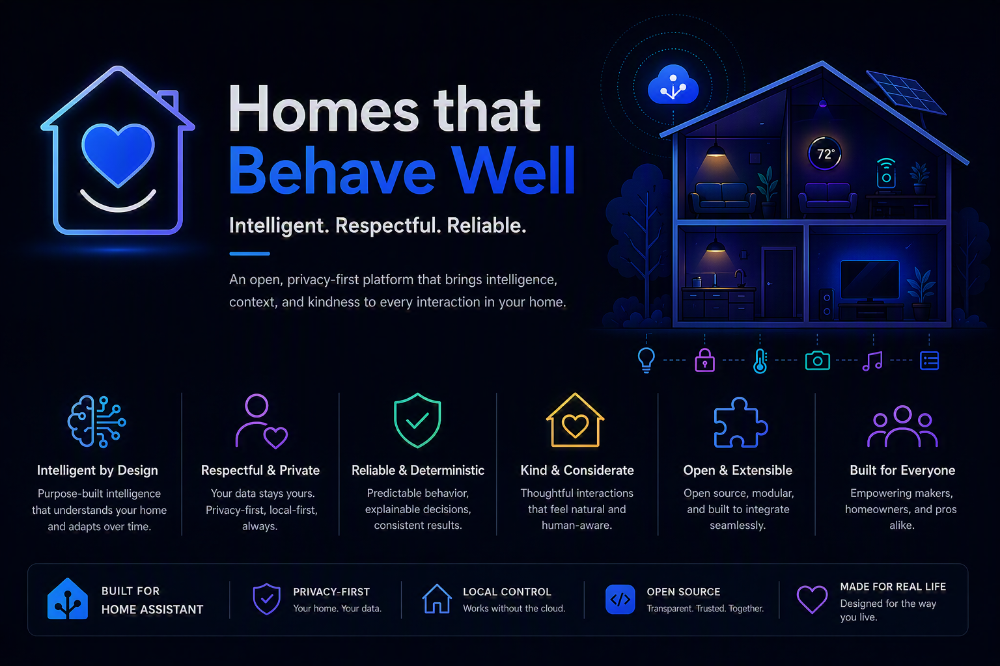
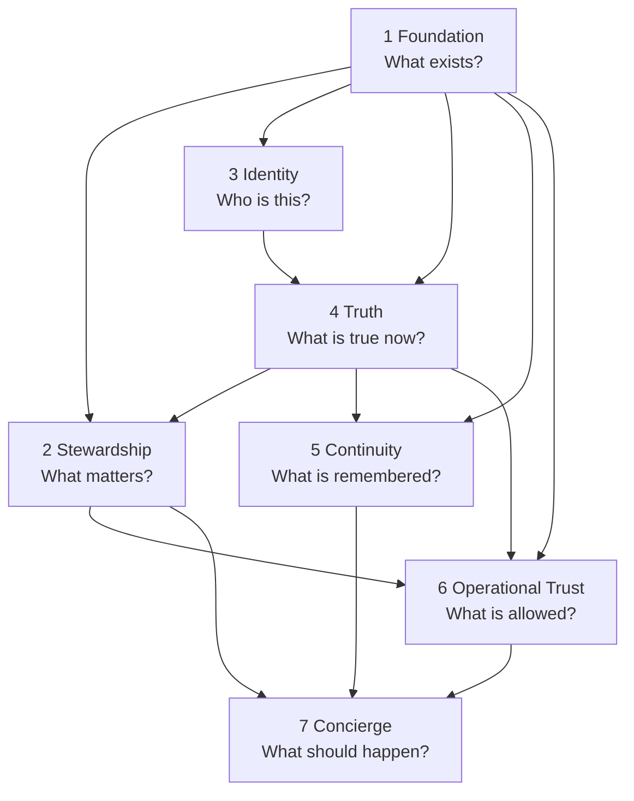

# Homes That Behave Well

> **Document status: Canonical (constitutional) entry point.**
> Canonical authority order: [docs/governance/authority-order.md](docs/governance/authority-order.md).
> Canonical terminology: [docs/models/glossary.md](docs/models/glossary.md).
> Document classification for every file in this repository:
> [docs/governance/document-register.md](docs/governance/document-register.md).

**Homes That Behave Well (HTBW) is the constitutional architecture for homes that are calm,
predictable, explainable, and trustworthy.**

This repository defines the framework. It does not execute runtime logic.

---

## The framework

HTBW Core is defined by **seven responsibilities**, in framework order.

| # | Responsibility | Question |
|---|---|---|
| 1 | **Foundation** | What exists, and how do we describe it? |
| 2 | **Stewardship** | What matters, and what must be cared for? |
| 3 | **Identity** | Who do we believe this is? |
| 4 | **Truth** | What is actually true now? |
| 5 | **Continuity** | What should be remembered, resumed, or transferred? |
| 6 | **Operational Trust** | What is allowed? |
| 7 | **Concierge** | What should happen now? |

Two things are deliberately **not** layers:

- **Human Trust is an outcome**, not a component. It emerges when the home behaves predictably and
  explains itself.
- **Behavioral Governance is cross-cutting**, expressed through Operational Trust policy and the
  Decision Trace.

> **Concierge orchestrates. It does not own everything it consumes.**

> **The framework provides governed capability. The household provides the values, priorities,
> consent, and care expectations.** The household declares what matters; **Stewardship** represents
> that declaration and creates governed care obligations. Operational Trust determines what is
> appropriate for a request in a context; it does not author the household's values.

Full definition: [docs/architecture/north-star.md](docs/architecture/north-star.md) and
[docs/architecture/framework.md](docs/architecture/framework.md).

---

## Constitutional refoundation

This repository was refounded on the seven-responsibility framework. The refoundation superseded the
earlier **four-service platform model** (Foundation, Asset Intelligence, Voice Identity, Concierge).

| Previously asserted | Current disposition |
|---|---|
| Foundation owns truth | **Truth** is a first-class fact engine; Foundation defines what a Fact *is* |
| Asset Intelligence answers "what matters" | **Stewardship** answers it; the asset model is Foundation-owned descriptive knowledge |
| Voice Identity is a platform service | **Identity** is the responsibility; voice is one evidence source |
| Room Configuration belongs to Concierge | **Foundation** owns it, as an interaction-definition model |
| No fifth platform service | Superseded — there are seven responsibilities |

Recorded in [docs/governance/decision-ledger.md](docs/governance/decision-ledger.md) and
[docs/architecture/adr-htbw-core-refoundation.md](docs/architecture/adr-htbw-core-refoundation.md).

**Asset Intelligence, Voice Identity, and Concierge remain separate released products** with their own
lifecycles. HTBW Core is greenfield and creates no compatibility requirement for them. See
[docs/architecture/greenfield-mandate.md](docs/architecture/greenfield-mandate.md).

---

## Dependency direction

Dependencies flow **downward only**. Nothing depends on Concierge. See
[docs/architecture/dependency-view.md](docs/architecture/dependency-view.md).

---

## Principles

Twenty-six principles govern the framework. The ones most often needed:

- **P8** — Evidence is not Truth
- **P9** — An identity assertion is not a contextual truth
- **P13** — Concierge orchestrates; it does not own everything it consumes
- **P14** — Explicit configuration over runtime discovery
- **P15** — Uncertainty must remain visible
- **P16** — The home must explain both its actions and its non-actions
- **P17** — Architecture outlasts technology
- **P19** — Operational Trust is a responsibility; Human Trust is an outcome
- **P21** — Home Assistant First
- **P22** — Connected Storage
- **P23** — Native Experience
- **P25** — The framework is vendor-agnostic
- **P26** — A learned suggestion is not an autonomous policy

Full list: [docs/architecture/principles.md](docs/architecture/principles.md).

---

## Home Assistant position

**Home Assistant First.** Before HTBW builds a capability: does Home Assistant already provide it? If
yes, use it. If partially, extend it natively. If no, build it — and record why.

**Native Experience.** HTBW presents as a native part of Home Assistant. No invented UI standards.

**Vendor-agnostic.** Home Assistant is the first implementation environment, not a constraint on the
architecture.

**Object distinctions are preserved.** A Home Assistant Device, Entity, or Area is never automatically
the same object as an HTBW Asset, Person, Pet, Room, or Service.

See [docs/architecture/home-assistant-boundary.md](docs/architecture/home-assistant-boundary.md).

---

## Reading order

**Start here:**

1. [docs/architecture/north-star.md](docs/architecture/north-star.md) — the constitution
2. [docs/architecture/framework.md](docs/architecture/framework.md) — the seven responsibilities in full
3. [docs/models/glossary.md](docs/models/glossary.md) — canonical terminology
4. [docs/architecture/principles.md](docs/architecture/principles.md) — P1–P26

**Then:**

5. [docs/architecture/dependency-view.md](docs/architecture/dependency-view.md)
6. [docs/architecture/runtime-sequence.md](docs/architecture/runtime-sequence.md)
7. [docs/contracts/README.md](docs/contracts/README.md)
8. [docs/scenarios/README.md](docs/scenarios/README.md)
**Governing behavior:**

- [docs/architecture/behavioral-governance.md](docs/architecture/behavioral-governance.md)
- [docs/architecture/explainability.md](docs/architecture/explainability.md)
- [docs/architecture/failure-and-degradation.md](docs/architecture/failure-and-degradation.md)
- [docs/architecture/privacy.md](docs/architecture/privacy.md)

**Building it:**

- [docs/architecture/greenfield-mandate.md](docs/architecture/greenfield-mandate.md)
- [docs/architecture/home-assistant-boundary.md](docs/architecture/home-assistant-boundary.md)
- [docs/architecture/connected-storage.md](docs/architecture/connected-storage.md)
- [docs/assessment/assessment-to-platform.md](docs/assessment/assessment-to-platform.md)

**Voice evidence:**

- [docs/architecture/adr-wyoming-compatible-voice-evidence-runtime.md](docs/architecture/adr-wyoming-compatible-voice-evidence-runtime.md)
  — Accepted as **DL-50**. The capability execution host, the Wyoming boundary, and the Voice Evidence
  Provider Principle.

**Governance:**

- [docs/governance/authority-order.md](docs/governance/authority-order.md)
- [docs/governance/decision-ledger.md](docs/governance/decision-ledger.md)
- [docs/governance/open-decision-issue-index.md](docs/governance/open-decision-issue-index.md)
- [docs/governance/document-lifecycle.md](docs/governance/document-lifecycle.md)
- [docs/governance/document-register.md](docs/governance/document-register.md)
- [docs/governance/season-1-architectural-baseline.md](docs/governance/season-1-architectural-baseline.md)
  — point-in-time status snapshot. **Not authority.**

---

## Repository structure

| Path | Contents |
|---|---|
| `docs/architecture/` | The framework, principles, cross-cutting concerns, and ADRs |
| `docs/models/` | Canonical models for each responsibility, plus the glossary |
| `docs/contracts/` | Explicit boundaries between responsibilities |
| `docs/scenarios/` | Canonical acceptance scenarios |
| `docs/assessment/` | Assessment-to-platform traceability |
| `docs/governance/` | Authority order, document lifecycle, decision ledger, document register, open-decision issue index |
| `docs/philosophy/` | Why the home behaves as it does |
| `docs/patterns/` | Implementation patterns (subordinate to canon) |
| `docs/development/` | Development checklists and guardrails |
| `examples/` | Historical illustrations, retained as evidence |

---

## Document status

**Every Markdown file in this repository carries a status banner.** Canonical documents define the
framework; historical documents are retained as architectural evidence and are not current authority.

When documents disagree, [docs/governance/authority-order.md](docs/governance/authority-order.md)
decides. Every file's disposition is recorded in
[docs/governance/document-register.md](docs/governance/document-register.md).

---

## Open decisions

**Seventy-four decisions are deliberately unresolved**, recorded as **OD-01** through **OD-84** in
[docs/governance/decision-ledger.md](docs/governance/decision-ledger.md) — including the Home Assistant
representation strategy, Truth Fact confidence representation, identity-confidence thresholds,
Decision Trace retention, and the Stewardship obligation lifecycle. Ten of the eighty-four
identifiers are closed or resolved and are preserved rather than deleted.

**A deliberately open decision is not a gap.** Recording it honestly is better than inventing an answer
the household has not chosen.

> **GitHub issues are the authoritative source for the current status, remaining questions,
> dependencies, and closure evidence of each open decision. This repository remains authoritative for
> accepted architecture.** The identifier-to-issue mapping is
> [docs/governance/open-decision-issue-index.md](docs/governance/open-decision-issue-index.md).

---

## The governance test

The documentation in this repository must be able to answer, without contradiction:

What exists? · What participates? · What is exposed? · What do residents call it here? · Who is this? ·
What is actually true? · What matters and must be cared for? · What should be remembered, resumed, or
transferred? · What is allowed? · What should happen now? · Why did it happen? · Why did it not happen? ·
Which policy or fact took priority? · Where is each responsibility defined? · Which decisions remain
open?

---

## How downstream repositories use this

Asset Intelligence, Voice Identity, and Concierge are **separate released products**. This repository
grounds their architectural decisions and records the discoveries made in building them. It does **not**
impose a compatibility requirement on them, and it contains no runtime code.

When a pattern evolves during implementation, it should be reflected here so the framework stays
coherent — subject to
[docs/governance/authority-order.md](docs/governance/authority-order.md), in which implementation is
rank 6 and does not override the framework.

---

## Design goal

This is not conventional automation.

It is a structured, explainable decision framework for the home — one that can always say what it
believed, what it did, what it did not do, and why.

The goal is not merely to automate devices.

The goal is to create a home that understands context, behaves predictably, and explains itself clearly.