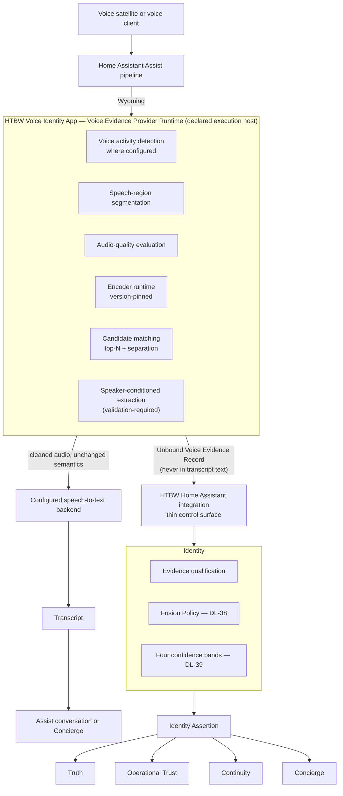
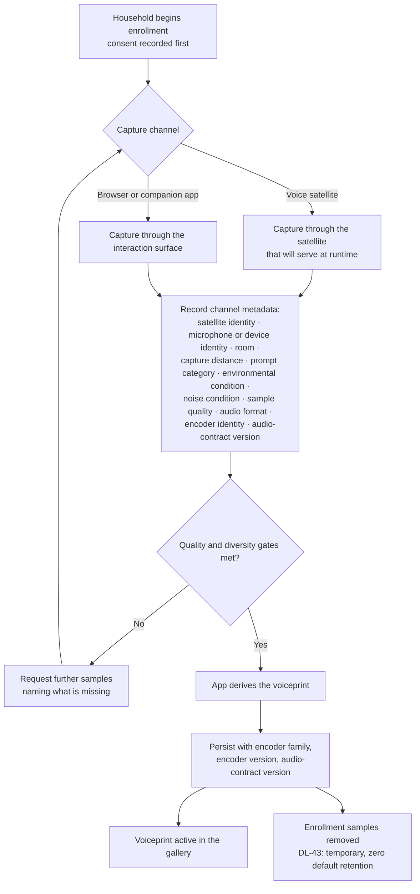
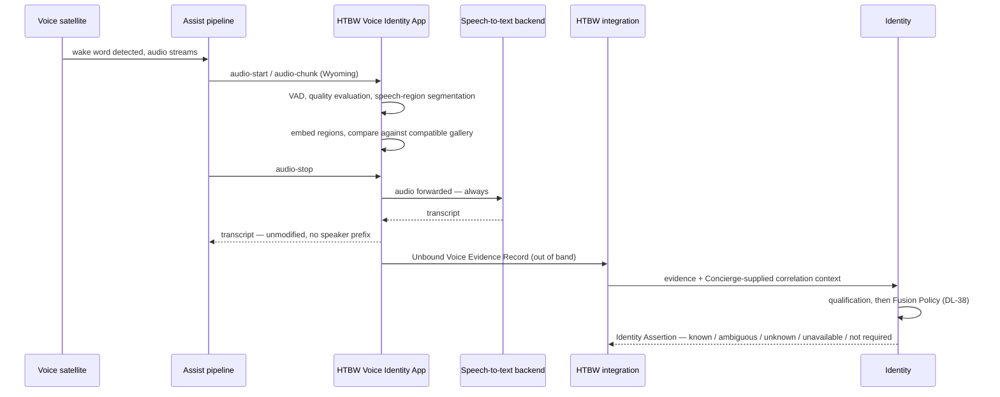
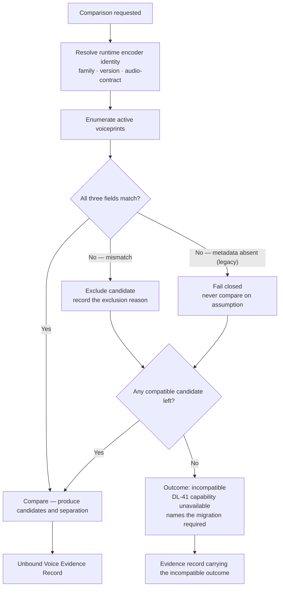
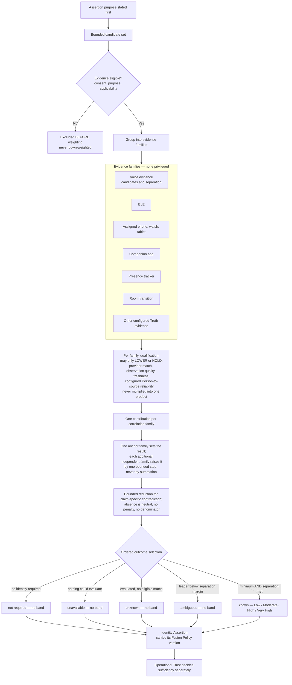
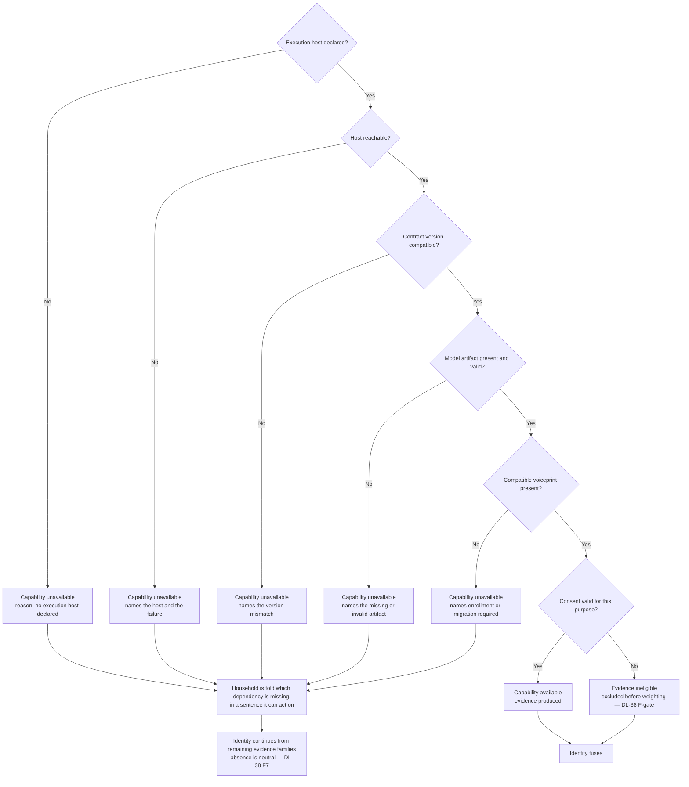
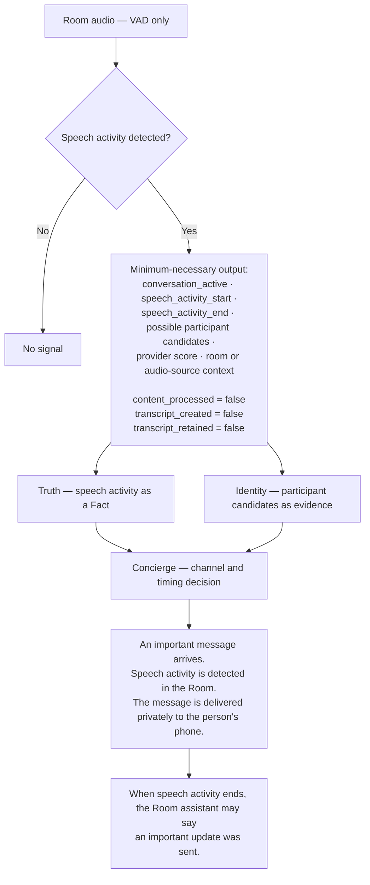
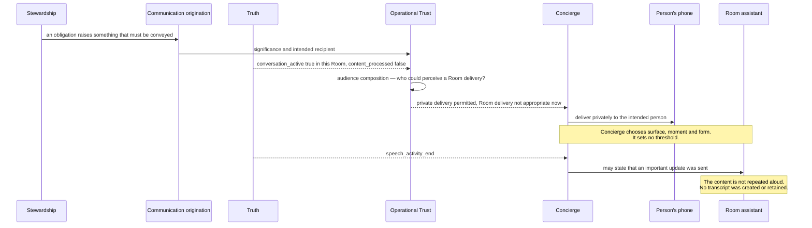
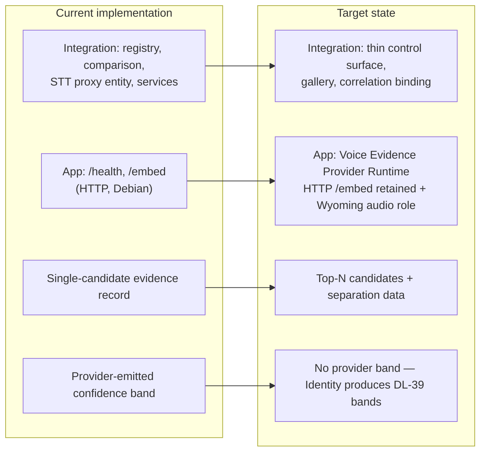

# ADR: Wyoming-Compatible Voice Evidence Runtime Architecture

> **Document status: Canonical ADR.**
> Status: **Accepted** 2026-08-25. Resolves **OD-80** (issue **#153**) as **DL-50**.
> Terminology: [../models/glossary.md](../models/glossary.md).
> Governing authority: [north-star.md](north-star.md), [framework.md](framework.md),
> [principles.md](principles.md), [home-assistant-boundary.md](home-assistant-boundary.md), and
> [adr-identity-replaces-voice-identity-boundary.md](adr-identity-replaces-voice-identity-boundary.md).

---

## 1. Status

**Accepted 2026-08-25.** Raised from a comparative research review of four third-party speaker
recognition projects and a verification pass over the official Wyoming protocol, the Home Assistant
Wyoming integration, and the current reference implementation.

| Aspect | Position |
|---|---|
| Open decision resolved | **OD-80 — Capability execution host** (issue **#153**), accepted as **DL-50** |
| Open decisions engaged but **not** resolved | **OD-07** (voice processing locality, #95), **OD-15** (#96), **OD-66** (#131), **OD-67** (#132), **OD-06** (#94) |
| Open decisions raised | **OD-82** — HTBW product consolidation and retirement (#160); **OD-83** — voiceprint gallery structure under channel diversity (#168); **OD-84** — multi-speaker evidence and speaker plurality (#169) |
| Accepted decisions reopened | **None** |
| Production code changed | **None** |

**What acceptance does and does not do.** It settles **where a capability may execute**, **what a
voice provider returns**, and **what may never happen to a transcript**. It authorises **no
implementation** — the roadmap phases are separately tracked, section 24 remains validation-gated, and
section 25 remains a North Star that this ADR explicitly does not approve.

---

## 2. Context

**Identity is the responsibility. Voice is one evidence source among many.** That is **DL-05**, and
this ADR does not disturb it. Nothing here restores Voice Identity as a platform-service boundary, a
second identity authority, or a separate responsibility.

Three things converged to make this decision necessary.

**A verified hosting failure.** A speaker-embedding encoder declared as a Home Assistant manifest
`requirements` entry had no installable wheel on the target host — no build for the interpreter
version below one release line, and no build for the platform libc above it. Because the manifest
`requirements` install is a **hard precondition for `async_setup_component`**, the resolution failure
failed the **entire integration** before any of its own code ran, regardless of how carefully that
code had been written to degrade without the dependency. This is the failure recorded verbatim in
**OD-80**.

**A verified ecosystem answer.** A review of four independent open-source speaker-recognition projects
for Home Assistant found that **every one of them runs its neural encoder outside the Home Assistant
Core process** — as a Docker container, a Home Assistant app, or a systemd service. Not one attempts
in-process execution. The ecosystem has already answered the question OD-80 asks.

**A verified audio-access boundary.** Speaker evidence requires audio. By the time the Assist pipeline
produces a transcript, the audio is gone. Home Assistant's `SpeechMetadata` carries only
`{language, format, codec, bit_rate, sample_rate, channel}` and no correlation identifiers, so a
speech-to-text provider is structurally unable to know which conversation, device, satellite, or
pipeline run it is serving. The **Wyoming protocol** is the documented, Home-Assistant-supported seam
at which raw streaming audio is available before the text boundary.

---

## 3. Problem statement

Four questions, none of which the repository currently answers.

1. **Where may an HTBW capability execute** when the Home Assistant integration process cannot host
   it, and how is that host declared, governed, and made explainable? (**OD-80**)
2. **How does HTBW obtain runtime audio** for voice evidence without owning speech-to-text, owning the
   conversation agent, or blocking transcription?
3. **What does a voice provider return**, such that Identity can fuse it under **DL-38** without the
   provider having resolved a person, produced fused confidence, or authorized anything?
4. **How is that evidence bound** to the interaction it belongs to, given that the protocol seam does
   not carry the correlation identifiers?

---

## 4. Decision

**Six decisions, stated together.**

### D1 — A capability may declare an execution host, and the host is a DL-41 dependency

An HTBW capability that cannot execute inside the Home Assistant integration process **may declare an
execution host**. The host is named in the capability's dependency declaration and in the Decision
Trace, exactly as any other dependency is. This adopts **OD-80 alternative (D)**, with alternative
**(B)** — a Home Assistant app — as the reference deployment rather than as the architecture.

**(D) rather than (B) alone, deliberately.** **P25** keeps Home Assistant the first implementation
environment and **not a constraint on the architecture**, and OD-80 itself records that apps exist only
on some installation types. A per-capability declared host satisfies both: the architecture names a
*declared host*, and the deployment names *which* host.

### D2 — The conformance rule OD-80 asked to be recorded

**A dependency that is optional to a capability must never be declared in `manifest.json`
`requirements`.** A hard manifest requirement is an all-or-nothing gate for the **entire integration**,
so declaring an optional dependency there converts a degraded capability into a total setup failure.

### D3 — Wyoming is the preferred voice-pipeline interoperability boundary

Where HTBW requires runtime audio, the **Wyoming protocol** is the preferred seam. It is a documented
Open Home Foundation standard, it is natively supported by the Home Assistant `wyoming` integration,
and it is the boundary at which audio exists. This discharges **DL-30** step 2 — an existing maintained
ecosystem capability — rather than inventing an HTBW transport.

**Wyoming is a protocol, not a component.** Wyoming is never called the Voice Identity App, and no
third-party Wyoming project becomes an HTBW dependency.

### D4 — The HTBW Voice Identity App is a runtime host, not a responsibility

The **HTBW Voice Identity App** is the artifact name of the out-of-process runtime that hosts
machine-learning and audio-processing capability. Its **architectural role name is Voice Evidence
Provider Runtime**. It is a **capability component**, never a responsibility, never a platform service,
and never a second identity authority. **DL-05 is unchanged.**

### D5 — The provider reports candidates; Identity resolves the person

A voice provider emits an **unbound Voice Evidence Record** carrying an ordered candidate list with
per-candidate provider-reported scores, separation data, quality metadata, and encoder identity. It
resolves no person, produces no fused confidence, and authorizes nothing. **DL-32**'s rule stands
verbatim: a provider match value is **retained as reported and never rewritten as fused confidence**.

### D6 — Speaker evidence never gates transcription and never travels in transcript text

A non-match, an unknown speaker, an unavailable provider, or an incompatible gallery **never suppresses
the transcript** and **never appears inside transcript content**. Identity is carried on a separate
governed channel.

---

## 5. Architectural scope

| In scope | Out of scope |
|---|---|
| Where a voice-evidence capability executes | Where any other HTBW capability executes — the rule generalises, the instances do not |
| The Wyoming seam and what crosses it | Which speech-to-text engine the household uses |
| The Voice Evidence Provider contract | The Identity Fusion Function — accepted as **DL-38**, unchanged |
| Enrollment channel metadata | Consent capture and revocation experience — **OD-06** |
| Encoder and gallery compatibility | Data residency and local-versus-cloud — **OD-07** |
| Capability availability and degradation | Third-party engines that decide and act — **OD-66** |
| Artifact classes already declared under **DL-43** | New artifact classes — none are created here |

---

## 6. Responsibility boundaries

**No new responsibility is created.** The seven remain seven.

| Owner | Owns |
|---|---|
| **Voice Evidence Provider Runtime** (HTBW Voice Identity App) | Encoder runtime; model loading, pinning, and integrity; audio preprocessing; voice-activity detection where configured; speech-region segmentation; voiceprint generation and comparison; candidate-list generation; provider-reported match values; audio-channel metadata; enrollment-sample processing; capability and health reporting; its own temporary artifacts under a declared lifecycle |
| **Identity** | Person resolution; evidence qualification; combining voice with every other evidence family; Fusion Policy; the four confidence bands; `known` / `ambiguous` / `unknown` / `unavailable` / `not required`; person-specific source reliability; the Identity Assertion; explainability of the identity result; the distinction between a provider score and fused confidence |
| **Operational Trust** | Whether an assertion is sufficient for a requested disclosure or action; whether confirmation is required; whether microphone-derived evidence is permitted for the purpose; audience and disclosure evaluation; the unidentified-person policy |
| **Truth** | Authoritative current-state Facts created from accepted evidence, including the Contextual Person-Presence Fact. **Speech activity detected is not conversation content, and neither is a Person location** |
| **Continuity** | Governed context required to resume, restore, transfer, or continue. **Owns no voiceprint, no recording, no assertion, and no conversation content** |
| **Concierge** | How and when governed assistance is delivered; channel, sequencing, routing, escalation, presentation, confirmation experience, recovery. **Never reinterprets a raw provider match as an Identity Assertion** |

**Two boundary statements are load-bearing.**

- **A provider does not authorize, deny, resolve trust, or select Concierge behaviour.**
- **A detection is never an Identity Assertion** (**DL-06**), and an Identity Assertion is never a
  presence Fact.

---

## Voice Evidence Provider Principle

**Providers produce evidence. HTBW produces decisions.**

| HTBW owns | A provider owns |
|---|---|
| **Identity** — person resolution, evidence qualification, fusion | **Audio processing** — VAD, quality evaluation, segmentation |
| **Confidence** — the four bands, and the distinction between a provider score and fused confidence | **Voiceprint generation** from enrollment audio |
| **Governance** — consent eligibility, retention, explainability, disclosure | **Candidate matching** against a compatible gallery |
| **Person resolution** — which Person, at what support level, for which purpose | **Technical scoring** — provider-reported values and separation data |

**Three consequences follow, and none of them is new.**

1. **A provider's best guess is not an answer.** It is one input to a fusion that also weighs BLE,
   phones, presence trackers, room transitions, and every other configured family, none of which is
   architecturally privileged (**DL-32**).
2. **A provider may be replaced without touching Identity.** If replacing the provider would change
   what HTBW *believes*, the boundary has already been crossed.
3. **A provider's absence is a dependency outcome, not an identity outcome.** The home says *"I cannot
   check your voice right now"*, never *"I do not know who you are"* (**DL-41**, **DL-33**).

**The principle is directional, and the failing direction is the quiet one.** A provider that returns
a person, a band, a threshold verdict, or a permission has not merely exceeded its contract — it has
relocated a governed decision into a component that produces no Decision Trace, consults no consent,
and evaluates no audience.

---

## 7. Runtime topology

**Other evidence families — BLE, assigned phones, watches and tablets, companion-app signals, presence
trackers, Wi-Fi associations, room transitions, vehicle associations, and explicit household
enrollment — enter Identity on exactly the same footing.** No source is architecturally privileged
(**DL-32**).

---

## 8. Home Assistant integration role

**The integration stays thin and gracefully degradable.**

| The integration does | The integration does not |
|---|---|
| Configuration, options, and capability enablement | Load a model |
| Register HTBW services and publish governed status | Execute inference |
| Hold the voiceprint gallery and its compatibility metadata | Carry a heavy dependency in `manifest.json` `requirements` |
| Supply correlation context authoritatively | Claim the speech-to-text platform as its purpose |
| Discover App health, version, and capability | Claim the conversation agent |
| Represent capability-unavailable under **DL-41** | Emulate the App when it is absent |

**`requirements` remains empty of optional heavy dependencies.** This is **D2**, and it is the single
conformance rule that would have prevented the verified failure.

**A speech-to-text platform entity is permitted only where the accepted pipeline design requires it,
and never as a way to claim the conversation.** Where a Wyoming placement makes it unnecessary, it is
not created.

---

## 9. HTBW Voice Identity App role

| Property | Statement |
|---|---|
| **What it is** | The declared execution host for voice-evidence capability |
| **Why it exists** | The integration process cannot install or execute the encoder runtime on the target host |
| **What it owns** | Section 6, first row — and nothing else |
| **What it never owns** | Person resolution, fusion, confidence bands, thresholds, trust, policy, permission, delivery, or the transcript |
| **Interface** | A versioned, explicit contract with health and capability discovery |
| **Locality** | Local by default. Residency remains **OD-07** and is not decided here |
| **Absence** | Capability unavailable under **DL-41**, naming the missing dependency in a sentence the household can act on |
| **Naming** | The artifact keeps its released name. The architectural role name is **Voice Evidence Provider Runtime** |

**The App is one instance of a general rule, not the rule.** Another capability may declare a
different host, or none.

---

## 10. Wyoming Protocol role

### Verified protocol facts

Verified 2026-08-25 against the official repository and the Home Assistant integration page.

| Fact | Source |
|---|---|
| Peer-to-peer TCP protocol, JSONL header plus binary payload; MIT; Open Home Foundation | `https://github.com/OHF-Voice/wyoming` |
| Service types advertised in `info`: `asr`, `tts`, `wake`, `handle`, `intent`, `satellite`, `mic`, `snd` | Same |
| Event families: Audio, Info, Speech Recognition, Text to Speech, Wake Word, Voice Activity Detection, Intent Recognition, Intent Handling, Audio Output, Voice Satellite, Timers, Miscellaneous | Same |
| **There is no speaker, identification, verification, or biometric service type, and no speaker-evidence event** | Same |
| `user-event` exists — *"user-defined event"* with `name`, `data`, and `context` | Same |
| `select-program` allows several programs of one type on one endpoint | Same |
| `info.satellite.area` — *"name of area where satellite is located (string, optional)"* | Same |
| `transcribe` and `transcript` each carry an opaque `context` object | Same |
| Home Assistant `wyoming` integration; introduced 2023.5; IoT class Local Push; supports auto-discovery | `https://www.home-assistant.io/integrations/wyoming/` |
| **Home Assistant now calls add-ons "apps"** — *"The Wyoming, Piper, and Whisper apps for Home Assistant (formerly known as add-ons)"* | Same |
| Reference app pattern: Docker build published as a Home Assistant app | `https://github.com/rhasspy/wyoming-addons` |
| An official Wyoming **ASR proxy** precedent exists — `stt-fallback` sits in front of Home Assistant speech-to-text entities | Same |

### The documented gap

**Wyoming has no first-class speaker-evidence event.** This is a verified absence, not an assumption.

**HTBW does not invent a protocol extension and does not smuggle identity through transcript text.**
Two conforming options exist, and the choice between them is implementation mapping under this ADR:

| Option | Mechanism | Note |
|---|---|---|
| **W1** | Out-of-band publication — the App reports evidence to the HTBW integration over its own versioned contract, while Wyoming carries only audio and transcript | Preferred. Zero protocol risk; no dependence on an event the protocol does not define |
| **W2** | `user-event` — the sanctioned user-defined event, carrying `name`, `data`, and `context` | Permitted. **Servers are documented to drop unrecognised events**, so this is backward compatible by construction |

**Prohibited regardless of option:** a `[speaker]` transcript prefix, an identity field appended to
`transcript.text`, or any use of transcript content as an identity channel.

**Terminology.** Wyoming is the **protocol**. The App **implements one or more Wyoming-compatible
service roles**. Wyoming is never described as an HTBW component.

---

## 11. Voice Evidence Provider contract

**Conceptual and provider-neutral.** Property names are **implementation mapping**, not architecture,
and must be reconciled against the existing implementation record before they are fixed.

### Runtime production of the record

```mermaid
flowchart LR
    A["Audio stream via Wyoming"] --> B["VAD and quality evaluation"]
    B --> C["Speech-region segmentation"]
    C --> D["Embed each region<br/>version-pinned encoder"]
    D --> E["Compare against<br/>compatible gallery only"]
    E --> F["Rank candidates<br/>compute separation"]
    F --> G["Unbound Voice Evidence Record"]

    subgraph CARRIES["What the record carries"]
        G3["evidence_id, provider id and version"]
        G4["observation time, expiry"]
        G5["encoder family, version, audio-contract"]
        G6["audio quality, region metadata, channel"]
        G7["ordered candidates, provider score each"]
        G8["separation, ambiguity indicators"]
        G9["warnings, capability status"]
    end

    subgraph NEVER["What it never carries"]
        N1["resolved Person"]
        N2["confidence band"]
        N3["fused confidence"]
        N4["threshold verdict"]
        N5["authorization or permission"]
        N6["correlation identifiers"]
        N7["audio, transcript, embeddings"]
    end

    G --> CARRIES
    G -.->|excluded by construction| NEVER
```

### Elements the contract must be able to represent

| Group | Elements |
|---|---|
| Identity of the record | `evidence_id`; provider identifier; provider version |
| Source | Source device; source room where available; pipeline correlation information **where legitimately available** |
| Time | Observation timestamp; expiry timestamp |
| Encoder identity | Encoder family; encoder version; audio-contract version |
| Audio | Audio-quality measures; speech-region metadata; channel metadata |
| Result | **Ordered candidate list** with a provider-reported score per candidate; winner-to-runner-up separation; ambiguity indicators |
| Health | Processing metadata; processing warnings; provider capability status |
| Outcomes | No-match; unavailable; incompatible |

### What the contract must never claim

Final person resolution · fused confidence · a confidence band · a threshold verdict · authorization ·
permission · a Trust outcome · a Concierge outcome.

### Reconciliation with the existing implementation record

| Existing artifact | Alignment | Required change |
|---|---|---|
| `SpeakerEvidenceRecord` — unbound, `slots=True`, explicitly excludes `conversation_id`, `device_id`, `room_id`, `satellite_id`, `pipeline_id`, audio, transcript, embeddings, voiceprints | **Correct and preserved.** This is the correlation boundary implemented properly | Extend to carry an **ordered candidate list and separation data** in place of a single `speaker_candidate` |
| `ComparisonResult` — `known_matches`, `best_match`, `second_best_match`, `is_ambiguous` | Top-N and ambiguity already computed internally | **Publish** it. Today the candidate list exists but does not cross the boundary |
| `encoder_family`, `encoder_version`, `audio_contract_version` persisted and enforced before comparison | **Correct and preserved.** Stronger than any third-party project reviewed | None |
| `ConfidenceBand = unavailable \| unknown \| no_match \| low \| medium \| high \| ambiguous` | **Conflicts with DL-39.** Collapses state and band into one enum, uses `medium` rather than `Moderate`, and has no `Very High` | Provider must emit **no band at all**. Bands are Identity's output, produced by **DL-38** |
| `AttributionResult.attributed_person_id`, `is_confident` | **Conflicts with DL-06 and DL-32.** A provider resolving a person | Provider reports candidates; Identity resolves |
| A single default confidence threshold constant | **Conflicts with DL-36** — *"sufficiency is never universal"* | Thresholds are Fusion Policy configuration and Operational Trust requirements, never a provider constant |

**These are boundary corrections, not defects of ambition.** The implementation is ahead of every
third-party project reviewed on encoder pinning and correlation discipline.

---

## 12. Enrollment architecture

**Channel-aware enrollment is adopted.** A voiceprint recorded on a phone is not equally
representative of audio captured by a distant room satellite, and the reference implementation already
captures `capture_distance` and `prompt_category`. **Microphone and satellite identity are added as
diversity axes.**

**One question is deliberately not answered here.** Whether HTBW uses one person-global gallery with
channel diversity, per-channel derived profiles, or a hybrid is **not decided by this ADR**. The
repository has not decided it. It is recorded in section 28 as a residual and must not be chosen
silently.

**Artifact lifecycle is already accepted and is not re-decided.** **DL-43** states it: enrollment
samples are Identity-owned, **temporary with zero default retention**, removed on success, on
cancellation, on failure cleanup, on consent withdrawal, or on policy expiry, and **never become
historical identity evidence merely because they existed**; voiceprints are retained while the profile
remains enabled **and consent remains valid**, and are deleted on profile removal or consent
withdrawal.

---

## 13. Runtime matching architecture

**The transcript path and the evidence path are independent.** Failure on the evidence path degrades
identity, never speech.

### Speech-region segmentation

**Adopted as an App capability for controlled experimentation.** Detect speech regions, evaluate each
separately, generate evidence from relevant regions, and preserve competing-speaker and noisy-audio
conditions as **quality metadata**.

**Region-level matching is an App capability and never an Identity decision.** A provider may not
convert a non-match into a silent authorization denial.

---

## 14. STT relationship

| Rule | Statement |
|---|---|
| **Transcription always proceeds** | A non-match, an unknown speaker, an unavailable App, or an incompatible gallery never suppresses the transcript |
| **Comparison is enrichment-only** | Speaker evidence never blocks, delays past its budget, or alters the meaning of a transcript |
| **No identity in transcript content** | No prefix, no suffix, no appended field |
| **Downstream STT behaviour is unchanged** | The configured backend receives audio it can transcribe and behaves exactly as it does without HTBW present |
| **HTBW does not become the household's speech-to-text engine** | It may sit in front of one; it never replaces one |
| **HTBW does not claim the conversation agent** | Conversation remains Home Assistant's, or Concierge's, under their own boundaries |

---

## 15. Correlation boundary

**The correlation boundary is already settled in the reference implementation and this ADR preserves
it verbatim.**

Home Assistant's `SpeechMetadata` carries `{language, format, codec, bit_rate, sample_rate, channel}`
and **no correlation identifiers**. A speech-to-text provider's audio-stream entry point never receives
`conversation_id`, `device_id`, `satellite_id`, or `pipeline_id`.

**Wyoming does not close this gap.** Verified: `info.satellite.area` carries an area **name**, not a
stable `area_id`, and **DL-31** requires reference by stable identifier. The `context` object on
`transcribe` and `transcript` is opaque interaction context, not pipeline correlation.

| Rule | Statement |
|---|---|
| Evidence is produced **unbound** | The App emits evidence with no correlation identifiers, by construction |
| **Concierge is the sole authoritative source of correlation context** | Supplied explicitly on the identity request |
| Binding happens **later**, in HTBW | The authoritative binder is the HTBW integration acting for Identity, never the provider |
| **Recency-only matching is prohibited** | Device plus timing proximity is never an authoritative correlation method. **DL-35** already states that temporal proximity alone never establishes correlation |
| **A satellite area name is not a Room** | It may be recorded as provider metadata; it never resolves a Room by itself |
| Unresolvable correlation is **reported, never guessed** | The evidence remains unbound and is not consumed as though it were bound |

**Remaining contract work is tracked as an issue, not invented here.**

---

## 16. Encoder and gallery compatibility

**Preserved and formalised. This is the strongest property of the current implementation and no
third-party project reviewed has it.**

| Rule | Statement |
|---|---|
| Encoder family is recorded | On every voiceprint and every evidence record |
| Encoder version is recorded | Same |
| Audio-contract version is recorded | Same |
| Compatibility is **enforced before comparison** | Not warned about afterwards |
| An incompatible gallery produces an **explicit outcome** | A capability or compatibility outcome under **DL-41** — *configured but invalid* is already an enumerated dependency state |
| **No README warning stands in for an invariant** | *"You must re-enroll after changing models"* is not a control |
| Model upgrade requires a **governed migration path** | Rebuild, re-derive, or re-enroll — declared before the upgrade, never discovered after it |
| Runtime identity is derived from the **resolved runtime encoder** | Not from a static pinned constant, which can falsely exclude a compatible candidate |

**An incompatible gallery is a dependency outcome, never an identity failure and never a trust
failure** (**DL-41**).

---

## 17. Unknown and ambiguous outcomes

**Both remain first-class, and neither is created by this ADR — both are already accepted.**

**This diagram depicts DL-38 and DL-39 as already accepted. It adds nothing to them.**

| Outcome | Meaning | Rule |
|---|---|---|
| `known` | Leading candidate reaches the purpose minimum **and** satisfies the separation requirement | Carries one of **Low < Moderate < High < Very High** (**DL-39**) |
| `ambiguous` | Candidates too close to separate | **Carries no band.** Never resolved by picking the leader |
| `unknown` | A provider evaluated successfully and returned no eligible match | **Never reported as `unavailable`** (**DL-33**). Carries whether a human participant is supported, so *"someone is here and I do not know who"* stays distinguishable |
| `unavailable` | The provider, host, or dependency could not evaluate | A **DL-41** dependency outcome |
| `not required` | No known-Person identity is required for this operation | **Never an absence of governance** |

**An Unknown Person creates no Home Assistant Person, owns no preferences, inherits nothing, generates
no person-scoped learning, and grants nothing** (**DL-33**). What an unidentified person may request is
the **unidentified-person policy**, owned by Operational Trust.

### Ambiguity is not plurality

**`ambiguous` means one speaker whose identity could not be separated between candidates. It does not
mean two people spoke.** A top-N candidate list expresses **uncertainty about one voice**, never
**plurality of voices**, and the two produce the same shape — several candidates scoring closely —
from opposite causes.

**HTBW already represents plurality in two places and in neither of them is it a speaker.** **DL-35**
makes *"one actor, several actors, and unresolved plurality"* representable for an **Unknown Actor
Reference** in a historical reconstruction. [../models/communication.md](../models/communication.md)
carries *Multiple known Persons* and *Unresolved plurality* as **audience composition** states — and
**DL-34** is explicit that audience composition *"identifies nobody"* and *"is never a second identity
fusion"*, so it cannot be borrowed here. **Audience answers who could hear. This question is who
spoke.**

**Whether an evidence record may report more than one speaker is OD-84, and it is not decided here.**
Until it is, an implementation **must not report plurality as `ambiguous`**, and a second speaker's
presence in a capture remains **quality metadata** under section 13 rather than a second candidate in
the list.

---

## 18. Capability availability and degradation

**Four rules bind.**

1. **HTBW does not emulate a missing dependency** — no approximation, no local stand-in, no silent
   reduction to something weaker sharing the same name (**DL-41**).
2. **Capability unavailable is never expressed as a trust failure, an identity failure, or a permission
   failure** (**DL-41**).
3. **Absence is neutral in fusion** — fewer sources lower the ceiling; they never impose a penalty and
   never create a denominator effect (**DL-38 F7**).
4. **A consent-excluded source is excluded before weighting**, not down-weighted (**DL-38**).

---

## 19. Privacy and local-first requirements

| Rule | Authority |
|---|---|
| Local-by-default execution; **cloud voiceprint generation is not the default architecture** | This ADR; residency remains **OD-07** |
| **Safe metadata only** leaves the provider — never vectors, embeddings, or storage paths | `privacy.md` |
| Raw audio is **transient** at the provider and is not persisted by default | **DL-43** |
| Voiceprints and enrollment samples are **internal runtime artifacts** and are **not exposed as resident media** | **DL-44** |
| Numeric provider scores are **not rendered to the household** | `privacy.md`; **DL-39** bands are the household-facing currency |
| Consent is **scoped** — consenting to voice identity is not consent to anything else | `person-and-identity.md`; capture experience is **OD-06** |
| **A required control that silently does not apply is a silent reduction and is prohibited** | **DL-41** — enforce it, or report it unmet |

---

## 20. Artifact lifecycle and retention

**No new artifact class is created.** Every artifact this architecture produces already has an accepted
**DL-43** declaration:

| Artifact | Owner | Retention |
|---|---|---|
| Voice enrollment samples | Identity | Temporary, **zero default retention** |
| Voiceprints and derived profiles | Identity | While the profile is enabled **and consent remains valid** |
| Voice Evidence Records | Identity | Retained **with the Decision Trace or governed history they support** — never under a separate universal duration, and never as a licence to retain biometric internals (**DL-47**) |
| App temporary processing artifacts | Voice Evidence Provider Runtime | Transient; declared before introduction (**DL-43**) |

### Rejected-audio retention

**Not enabled by default. Not enabled without governance.**

A near-miss telemetry loop is architecturally useful — top candidates, separation margin, audio-quality
measures, near-match reason, channel, region, processing duration, encoder-compatibility result — and
**all of that is metadata, not audio**.

**Retaining the raw rejected audio is a different thing entirely.** Rejected audio is, by definition,
disproportionately the audio of **guests, visitors, children, and unenrolled people** — those least
able to consent. If it is ever proposed, it requires, before creation and not after: explicit
configuration; a declared purpose; a retention duration; access controls; deletion behaviour; a consent
and privacy review; and a **DL-43** artifact declaration. **An unbounded default is prohibited.**

---

## 21. Security model

| Rule | Statement |
|---|---|
| The App interface is **authenticated** | An unauthenticated inference endpoint is an unauthenticated biometric endpoint |
| The App is **not a public surface** | It is reached by the HTBW integration, not by household automations |
| **A public surface is never an authority bypass** | Operational Trust evaluates appropriateness before any effect, regardless of who invoked it. Whether HTBW publishes public capability surfaces at all is **OD-81** |
| Model artifacts are **integrity-verified** | Pinned digest, validated on load |
| **HTBW acquires no host operating-system administration** | Consistent with the existing storage boundary (**DL-44**) |
| Provider timeouts are **bounded** and produce `unavailable` | Never an indefinite wait, never a silent success |
| Malformed evidence is **rejected**, never partially consumed | A partial biometric record is not a weaker record; it is an invalid one |

---

## 22. Provenance and open-source research

**No third-party source code is adopted.** Everything below is architectural knowledge, an API-contract
idea, or an algorithmic approach — reimplemented as HTBW-owned contracts.

| Source | License | Pattern taken | Classification | Attribution required |
|---|---|---|---|---|
| `OHF-Voice/wyoming` | MIT | Protocol facts; `user-event` as the sanctioned extension point; `select-program`; `info` service-type set | Published protocol specification | Cited as the standard |
| `rhasspy/wyoming-addons` | MIT | Docker-build-to-Home-Assistant-app packaging; the `stt-fallback` ASR-proxy precedent | General architectural knowledge | Cited as precedent |
| Home Assistant `wyoming` integration | Apache-2.0 | Native transport availability; auto-discovery; **"apps (formerly known as add-ons)"** terminology | Platform documentation | Cited as platform fact |
| `EuleMitKeule/speaker-recognition` | MIT | App-plus-thin-client packaging shape; a REST evidence contract distinct from the pipeline | Architectural knowledge | Cited; no code taken |
| `ExhaleSthlm/speaker-id` | MIT | **Top-N candidate response** with per-candidate scores; centroid rebuild as an explicit operation | API-contract idea | Cited; no code taken |
| `jxlarrea/wyoming-voice-match` | MIT | Speech-region segmentation with per-region scoring; **channel-matched enrollment**; separation-margin telemetry | Algorithmic approach | Cited; no code taken |
| `cybericebyte/VoiceBM` | MIT | Continuous passive evidence accrual into a shared gallery — **concept only** | Architectural knowledge | Cited; no code taken |

**Rules that bind any future adoption.**

1. No source code is introduced without an explicit license and attribution review.
2. HTBW implements **HTBW-owned contracts and provider interfaces informed by** the research.
3. **No single-maintainer external project becomes a mandatory HTBW dependency** without separate
   governance approval. Every project above has exactly one contributor.
4. Model licences are pinned and recorded alongside the encoder version.

---

## 23. Adopted external patterns

| # | Pattern | Adopted as |
|---|---|---|
| 1 | Out-of-process machine-learning runtime | **D1**, **D2** |
| 2 | Wyoming-compatible voice-pipeline participation | **D3**, section 10 |
| 3 | Thin integration plus App | Section 8 |
| 4 | Top-N candidate contract | **D5**, section 11 |
| 5 | Encoder and gallery compatibility | Section 16 — **already HTBW's, formalised** |
| 6 | Channel-aware enrollment | Section 12 |
| 7 | Speech-region segmentation | Section 13 — App capability, never an Identity decision |
| 8 | Speaker-conditioned audio extraction | Section 24 — **validation-required, not accepted behaviour** |
| 9 | Rejection and near-match telemetry | Section 20 — metadata adopted, raw audio not |
| 10 | Passive voice evidence and conversation-active | Section 25 — **North Star only** |

The eight patterns HTBW **accepts and intends to adopt**, with their provenance, are stated below.

---

## Harvested Architecture Patterns

**Accepted implementation patterns.** Each is adopted **where appropriate**, reimplemented as an
HTBW-owned contract. **No third-party source code is taken**, every source is MIT-licensed, and the
provenance rules in section 22 bind each one.

### Pattern 1 — Out-of-process runtime

**Source:** `EuleMitKeule/speaker-recognition`, `ExhaleSthlm/speaker-id`, `cybericebyte/VoiceBM`,
`jxlarrea/wyoming-voice-match` — four independent projects, converging.

**Decision.** Machine-learning runtimes **execute outside Home Assistant Core**. The Home Assistant
integration remains **dependency-light**. The **HTBW Voice Identity App is the preferred runtime
host**.

**Bound by.** **D1** — the host is a declared, per-capability **DL-41** dependency, so *preferred* is
not *mandatory* and no deployment topology is required by the architecture (**P25**). **D2** — an
optional dependency is never a manifest `requirements` entry.

### Pattern 2 — Wyoming-compatible participation

**Source:** the Wyoming protocol architecture.

**Decision.** The HTBW Voice Identity App **participates naturally in the Home Assistant voice
pipeline**. **Wyoming is adopted as a protocol boundary, not a product dependency.**

**Bound by.** Wyoming is never called an HTBW component. No third-party Wyoming project becomes a
runtime dependency. The protocol defines **no speaker-evidence event**, so evidence leaves by the
governed channel of section 10 — **never inside transcript text**.

### Pattern 3 — Top-N candidate evidence

**Source:** `ExhaleSthlm/speaker-id`.

**Decision.** Voice evidence providers return **ordered candidate sets rather than a single winner**.
**Identity is responsible for ambiguity handling and person resolution.**

**Bound by.** **DL-38 F8** — `known` requires the leading candidate to reach the purpose minimum *and*
satisfy a governed separation requirement. **A single winner gives fusion nothing to evaluate
separation against**, which is why this is a correction and not an enhancement.

### Pattern 4 — Channel-aware enrollment

**Source:** `jxlarrea/wyoming-voice-match`.

**Decision.** Enrollment metadata captures **microphone source, satellite source, room, capture
distance, and audio characteristics**. **A voiceprint records where enrollment occurred.**

**Bound by.** Recording where enrollment occurred is **not** the same as deciding how the gallery is
structured. That question — one person-global gallery with channel diversity, per-channel derived
profiles, or a hybrid — is **OD-83**, and it must not be settled by implementation choice.

### Pattern 5 — Speech-region segmentation

**Source:** `jxlarrea/wyoming-voice-match`.

**Decision.** **Region-level analysis is an approved implementation strategy** for Voice Identity
matching.

**Bound by.** Region-level matching is an **App capability and never an Identity decision**.
Competing-speaker and noisy-audio conditions are preserved as **quality metadata**. A provider may
never convert a non-match into a silent authorization denial (**D6**).

### Pattern 6 — Rejection telemetry

**Source:** `jxlarrea/wyoming-voice-match`.

**Decision.** **Near-match data, separation margins, and ambiguity information may be retained as
governed evidence.** **Raw audio retention remains opt-in.**

**Bound by.** Retained telemetry is a **governed record class** and therefore declares its retention
before it exists (**DL-47**) — it follows the Voice Evidence Record rule, retained **with the Decision
Trace or governed history it supports**, never under a separate universal duration and never as a
licence to retain biometric internals. **Opt-in is not a checkbox**: raw audio requires, before
creation, explicit configuration, a declared purpose, a retention duration, access controls, deletion
behaviour, a consent and privacy review, and a **DL-43** artifact declaration (section 20). Rejected
audio is disproportionately that of guests, visitors, children, and unenrolled people.

### Pattern 7 — Provider abstraction

**Source:** research findings across all four projects.

**Decision.** HTBW consumes **Voice Evidence Providers**. **Identity must never depend on a single
provider implementation.**

**Bound by.** The Voice Evidence Provider Principle above. Every project reviewed has exactly one
contributor, and two are effectively unmaintained — the abstraction exists so that **no maintainer
becomes load-bearing**.

### Pattern 8 — Passive conversation-state North Star

**Source:** VoiceBM concepts, and HTBW Concierge discussion.

**Classification: North Star capability only. Not accepted production functionality.**

Future exploration may include **speech activity**, **conversation active**, and **possible
participants** — **without** transcript generation, conversation storage, or semantic analysis.

**No implementation is authorized by this ADR.** Section 25 holds the gate: privacy review, retention
controls, microphone-governance policy, audience and disclosure review (**DL-34**), Truth
representation (**OD-74**, and **DL-39** bands may not be borrowed), and Concierge consumption design.

---

## 24. Speaker-conditioned audio extraction — validation required

**Classification: candidate capability. Not accepted production behaviour.**

The intended outcome is to improve the audio passed to speech-to-text when a television, radio, ambient
speech, or another person contaminates the microphone stream, keeping the operation local and
preserving every Identity and Trust boundary.

**It may not become accepted behaviour without all of:** technical validation; privacy review; quality
testing; unknown-person behaviour testing; transcript-integrity testing; and failure-mode analysis.

**One risk is specific and must be tested for directly.** Extraction **modifies the audio a household
member's words are transcribed from**. A false rejection of a legitimate speech region silently deletes
part of what a person said — which is a transcript-integrity failure that presents as a
speech-recognition error. **This is the mechanism by which "enrichment-only" could quietly stop being
true**, and it is why extraction is classified separately from every other pattern in section 23.

---

## 25. North Star — passive voice evidence and conversation-active

**Classification: North Star capability. Not current production behaviour. Not implemented. Not
approved.**

**The point of the capability is what it does not do.** The home does not transcribe, interpret, or
retain the conversation. **Detected speech activity is not captured conversation content**, and that
distinction is Truth's to hold.

### Concierge channel routing under the North Star

**Read the boundaries off the diagram.** Stewardship originates and never acts. Truth reports speech
activity and never content. Operational Trust evaluates audience and entitlement. Concierge chooses
channel, sequencing, and moment, and **sets no threshold** (**DL-36**). **Permission to act does not
imply permission to announce** (**DL-29**), which is why the **delivery** degrades and the governance
does not.

**Required before any implementation:** privacy review; retention controls; microphone-governance
policy; audience and disclosure review (**DL-34**); Truth representation (**OD-74** for Fact confidence,
which **may not borrow DL-39 bands**); and Concierge consumption design. **Continuous ambient
transcription is prohibited as the mechanism** — see section 26.

---

## 26. Rejected external patterns

**Recorded so that they are rejected once, explicitly, rather than re-argued.**

| # | Rejected pattern | Why |
|---|---|---|
| 1 | Identity embedded in transcript text | An identity assertion in a content field is logged, recorded, and passed to reasoning providers with **no audience evaluation** (**DL-34**) |
| 2 | Transcript prefixes such as `[Tom]` | Same, plus it breaks native intent matching |
| 3 | Provider match used directly as fused Identity confidence | **DL-32** — retained as reported, never rewritten |
| 4 | Provider match used directly as authorization | **DL-36** — Operational Trust owns every threshold |
| 5 | A non-match automatically suppressing speech-to-text | Removes `unknown` as an expressible outcome (**DL-33**) |
| 6 | Unknown speakers converted into empty transcripts | Same |
| 7 | A voice provider owning Trust policy | **DL-14** |
| 8 | A voice provider owning Concierge behaviour | Concierge contract |
| 9 | Unbounded raw rejected-audio retention | **DL-43**; privacy; disproportionately captures those least able to consent |
| 10 | An external stateful vector store as a required household dependency | **DL-30** burden undischarged; **DL-42**; a household gallery is single-digit records |
| 11 | Hard dependency on one community repository or maintainer | Section 22, rule 3 |
| 12 | Model changes that silently invalidate stored voiceprints | Section 16 |
| 13 | Ambient transcript creation as the default conversation-state mechanism | Section 25; **P27** minimisation; **DL-34** |
| 14 | Cloud voiceprint generation as the default architecture | Section 19; residency remains **OD-07** |

---

## 27. Consequences

### Positive

- **OD-80's verified failure cannot recur** once **D2** is applied.
- Speaker evidence becomes **fusable** — a candidate list with separation data is what **DL-38** F8
  actually needs, and a single winner is not.
- HTBW gains access to runtime audio **without owning speech-to-text or the conversation**.
- The provider boundary becomes **swappable**, so no maintainer or project becomes load-bearing.
- Enrollment quality improves in the dimension that actually fails in deployment — the channel.

### Negative, and accepted

- **Availability becomes deployment-dependent.** Apps exist only on some Home Assistant installation
  types. This is stated by OD-80 itself and is the honest cost of alternative (B) as a reference
  deployment. **D1** limits the damage by making the host declared rather than assumed.
- **Two artifacts must be released and version-matched.** Version-skew becomes a real failure mode and
  is why capability discovery is mandatory rather than optional.
- **A proxy placement adds a hop** in the audio path. Latency budgets become a contract concern.
- **The correlation gap is not closed by Wyoming**, only preserved honestly. Binding still requires
  Concierge-supplied context.

### Neutral

- No responsibility is created, moved, split, or renamed.
- No accepted decision is reopened.
- No production code is changed by this ADR.

---

## 28. Risks

| Risk | Severity | Mitigation |
|---|---|---|
| **Extraction silently truncates legitimate speech** | High | Section 24 — validation gate; extraction is classified separately and is not accepted behaviour |
| **The App becomes a second identity authority by drift** | High | Section 6; the contract forbids person resolution, bands, and thresholds at the provider |
| **Band vocabulary drift** — provider bands re-entering as Identity bands | Medium | Section 11 — the provider emits no band at all |
| Version skew between integration and App | Medium | Mandatory capability and version discovery; incompatible produces `unavailable` |
| A single-maintainer upstream project becomes load-bearing | Medium | Section 22, rule 3 |
| Model licence drift | Medium | Licence pinned with the encoder version |
| Near-miss telemetry grows into an audio archive | Medium | Section 20 — metadata adopted, raw audio gated |
| **Gallery-versus-channel question decided silently** | Medium | Recorded as a residual below; must not be chosen by implementation |
| Latency regression in the voice pipeline | Low | Bounded provider budget; timeout yields `unavailable`, never a stalled pipeline |

### Residuals not decided by this ADR

**Gallery structure under channel diversity** — one person-global gallery with channel diversity,
per-channel derived profiles, or a hybrid. **Recorded as OD-83** rather than settled by implementation
choice. Pattern 4 decides that a voiceprint **records where enrollment occurred**; it does not decide
how the gallery is **structured**, and the two must not be conflated.

**Speaker plurality** — whether an evidence record may report that **more than one person spoke**.
**Recorded as OD-84.** See section 17: **ambiguity is not plurality**, and an implementation must not
report one as the other.

**Two questions were tested against the harvest and deliberately answered *no*.** A separate
`voice-evidence-provider-contract.md` is **not** created, because
[../contracts/README.md](../contracts/README.md) defines a contract as *"the explicit boundary of a
responsibility"* describing *"obligations between responsibilities, not transport, schema, or platform
mechanics"* — and **a provider is a component, not a responsibility**. The provider boundary belongs
in [../contracts/identity-contract.md](../contracts/identity-contract.md), where it now is. A
**provider plug-in or registry framework** is likewise **not** created: **DL-41** already enumerates
*a provider* as a dependency class, and building a registration framework would be a new HTBW
capability requiring the **DL-30** burden to be discharged first.

---

## 29. Alternatives considered

| Alternative | Verdict |
|---|---|
| **(A)** Refuse an execution host; leave such capability permanently unavailable | **Rejected.** A large capability loss taken by omission, and the household is given no path |
| **(B)** A Home Assistant app as *the* governed execution host | **Rejected as the architecture, adopted as the reference deployment.** Binding HTBW to one deployment topology contradicts **P25** |
| **(C)** A household-provided external service or device referenced like any other provider | **Not rejected — permitted under D1**, and it engages **OD-07** and consent. Not the reference deployment |
| **(D)** A per-capability declared host, named in the dependency declaration and the Decision Trace | **Adopted.** The most explainable and the most to specify, which is the correct trade for a constitutional rule |
| **(E)** Native-only; bound capability ambition to what the environment can install | **Rejected.** Would have removed voice evidence entirely on the verified host |
| Consume a third-party speaker-recognition project as a runtime dependency | **Rejected.** All four reviewed have one contributor; two are effectively unmaintained; adopting their integration layers would import competing STT and conversation ownership |
| Extend the Wyoming protocol with a new first-class speaker event | **Deferred, not rejected.** Section 10 records the gap; `user-event` already provides a backward-compatible path, and proposing a protocol change is a separate conversation with the Open Home Foundation |
| Carry identity in the transcript because it solves correlation for free | **Rejected.** Section 26, rows 1 and 2 |

---

## 30. Migration from the current implementation

**No production code is changed by this ADR.** This is the target-state migration description.

| # | Question | Position |
|---|---|---|
| 1 | Which integration modules remain | Voiceprint registry and storage; compatibility enforcement; candidate provider; services; config and options; health and diagnostics projection; evidence publication |
| 2 | Which modules move to the App | Encoder runtime; model loading, download, and integrity validation; feature extraction; audio preprocessing; VAD; segmentation; embedding. **Already done** — an accepted implementation-repository ADR created a Debian-based app with `GET /health` and `POST /embed` |
| 3 | Which provisional implementations retire | The deterministic development encoder as a runtime path; any single-winner evidence shape; any provider-emitted confidence band; any universal confidence-threshold constant |
| 4 | How existing voiceprints are handled | Records carrying full encoder metadata are retained. Legacy all-`None` records **fail closed** and are re-enrolled |
| 5 | How encoder identity is preserved | Unchanged — the three-field invariant already exists and is enforced at persistence |
| 6 | Is re-enrollment required | **Only for legacy records without encoder metadata**, and for a governed model upgrade. Not otherwise |
| 7 | How configuration migrates | Host declaration is added as a capability dependency. Existing options are preserved |
| 8 | How provider health is exposed | Capability and version discovery, projected as governed status. **Never as a numeric score** |
| 9 | How unavailable capability is represented | Section 18 — a **DL-41** dependency outcome naming the missing dependency |
| 10 | How standalone product naming is removed from the surface while the responsibility remains | **This is not decided here.** The responsibility is Identity (**DL-05**) and the artifact keeps its released name. The product-consolidation question is raised as **OD-82** — see section 32 |
| 11 | How legacy coupling is eliminated | The consumer supplies correlation context explicitly and consumes evidence through the contract. No consumer reinterprets a raw provider match |
| 12 | How tests divide | Section 31 |

**One reconciliation is required and is recorded honestly.** The implementation-repository ADR
`ADR_PRODUCTION_INFERENCE_HOSTING_MODEL.md` (Accepted, 2026-07-30) **rejected Wyoming** on the grounds
that *"the ECAPA embedding service does not fit the Wyoming audio-stream model. The simpler HTTP API is
a better fit."*

**That judgement was correct for the seam it evaluated and does not conflict with D3.** It evaluated
Wyoming as the transport for a **one-shot embedding microservice**, where HTTP is indeed the better
fit. **D3 adopts Wyoming at a different seam** — the streaming audio path, where the embedding service
is not the thing being exposed. Both hold simultaneously: **HTTP internally for inference, Wyoming
externally for audio access.** Under the authority order that ADR is rank 5 evidence and does not bind
this repository, but it is not overridden here — it is scoped.

---

## 31. Implementation phases

**Not implemented by this ADR.** Recorded as the roadmap.

| Phase | Scope |
|---|---|
| **1 — Architecture and contracts** | This ADR accepted; Voice Evidence Provider contract; App-and-integration responsibility boundary; capability discovery contract, **including optional-feature discovery so a provider declares which of segmentation, extraction, and passive capture it supports**; **provider-substitution migration**, which is the model-upgrade rule of section 16 applied to a change of provider rather than of model; retention classification |
| **2 — App runtime foundation** | Supported encoder runtime; model loading; health; version reporting; local artifact storage; API authentication; capability reporting |
| **3 — Enrollment** | Wyoming or satellite capture path; channel metadata; quality gates; voiceprint creation; gallery compatibility; re-enrollment and migration |
| **4 — Runtime matching** | Pre-STT audio access; top-N candidate result; separation data; ambiguous and no-match outcomes; unbound evidence publication |
| **5 — Wyoming pipeline integration** | Proxy or service placement; unchanged downstream STT behaviour; no transcript prefixing; no transcript blocking by default; correlation validation |
| **6 — Advanced audio processing** | Speech-region segmentation; speaker-conditioned extraction experiment; noise and television testing; multi-speaker testing |
| **7 — North Star conversation-state evidence** | Passive VAD feasibility; minimum-necessary participant evidence; privacy and retention controls; Truth representation; Concierge channel-selection consumption |

### Where each harvested pattern lands

| Pattern | Phase | Issue |
|---|---|---|
| 1 — Out-of-process runtime | 2 | #162 |
| 2 — Wyoming-compatible participation | 5 | #165 |
| 3 — **Top-N provider contract** | 1 (contract), 4 (published) | #161, #164 |
| 4 — **Channel-aware enrollment** | 3 | #163 |
| 5 — **Speech-region processing** | 6 | #166 |
| 6 — Rejection telemetry | 6 | #166 |
| 7 — Provider abstraction | 1 | #161 |
| 8 — **Conversation-state research** | 7 | #167 |
| — **Speaker-conditioned extraction evaluation** | 6, **validation-gated** | #166 |

**Two phases are not authorisations.** Phase 6 carries the section 24 validation gate; Phase 7 is
North Star research and this ADR approves no implementation of it.

### Testing strategy

**Home Assistant is not installed for this work.** Deterministic fixtures reproduce results without
live biometric hardware — which is already an accepted Identity guarantee.

App unit · integration unit · provider-contract · encoder-compatibility · gallery-migration ·
enrollment-quality · candidate-order · separation-margin · no-match · unknown-person ·
ambiguous-speaker · App-unavailable · App-version-incompatible · provider-timeout · malformed-evidence ·
raw-audio-retention · Wyoming event-flow · **downstream STT integrity** · multi-room satellite ·
television and background-speech · multiple-speaker · end-to-end development-environment exercises.

**Household validation is eyes-and-ears from the Home Assistant environment**, using the existing
repository deploy script when implementation begins.

---

## 32. Related decisions and issues

### Accepted decisions this ADR depends on and does not reopen

**DL-05** · **DL-06** · **DL-15** · **DL-19** · **DL-20** · **DL-30** · **DL-31** · **DL-32** ·
**DL-33** · **DL-34** · **DL-36** · **DL-38** · **DL-39** · **DL-41** · **DL-42** · **DL-43** ·
**DL-44** · **DL-45** · **DL-46** · **DL-47**

### Open decisions

| ID | Issue | Relationship |
|---|---|---|
| **OD-80** | **#153** | **Resolved by this ADR as DL-50** |
| **OD-82** | **#160** | **Raised by this ADR.** Product consolidation and retirement — see below |
| **OD-83** | **#168** | **Raised on acceptance.** Voiceprint gallery structure under channel diversity — see §28 |
| **OD-84** | **#169** | **Raised by the post-acceptance harvest.** Multi-speaker evidence and speaker plurality — see §17 |
| **OD-07** | #95 | Voice processing locality. **Engaged, not resolved** |
| **OD-06** | #94 | Consent capture and revocation. **Engaged, not resolved** |
| **OD-15** | #96 | Assertion lifetime. Untouched |
| **OD-66** | #131 | Delegation boundary. The App is **HTBW's own capability**, not a third-party engine that decides and acts — distinct, and not preempted |
| **OD-67** | #132 | Reasoning provider strategy. A speech-to-text provider **must not be merged** with a reasoning provider |
| **OD-74** | #93 | Truth Fact confidence. Relevant to section 25. **DL-39 bands may not be borrowed** |
| **OD-81** | #159 | Capability exposure and self-consumption. Section 21 defers to it |

### OD-82 — raised, not decided

**A direct contradiction was found and is recorded rather than resolved.**

The execution premise states that the standalone Voice Identity, Asset Intelligence, and Concierge
projects are **being harvested into and retired in favour of a unified HTBW project**.

[../governance/authority-order.md](../governance/authority-order.md) records as a **non-negotiable
constraint that binds regardless of rank**: *"Asset Intelligence, Voice Identity, and Concierge remain
**separate released products** with their own lifecycles."* **DL-08** and **DL-19** state the same
separation from the greenfield side.

**This ADR does not resolve that contradiction and does not assume either outcome.** Every statement
here holds whether the products are consolidated or remain separate, because this ADR governs the
**responsibility architecture** and not the **product portfolio**. **Acceptance of this ADR therefore
resolves nothing about OD-82**, and nothing here may be cited as evidence for either alternative. The
question is recorded as **OD-82** in
[../governance/decision-ledger.md](../governance/decision-ledger.md).

---

## Related documents

- [home-assistant-boundary.md](home-assistant-boundary.md)
- [adr-identity-replaces-voice-identity-boundary.md](adr-identity-replaces-voice-identity-boundary.md)
- [adr-home-assistant-first-and-connected-storage.md](adr-home-assistant-first-and-connected-storage.md)
- [failure-and-degradation.md](failure-and-degradation.md)
- [privacy.md](privacy.md)
- [connected-storage.md](connected-storage.md)
- [../contracts/identity-contract.md](../contracts/identity-contract.md)
- [../models/person-and-identity.md](../models/person-and-identity.md)
- [../governance/decision-ledger.md](../governance/decision-ledger.md)
- [../governance/open-decision-issue-index.md](../governance/open-decision-issue-index.md)
