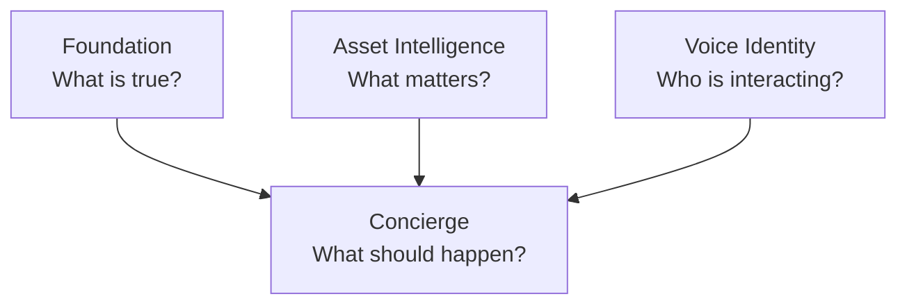
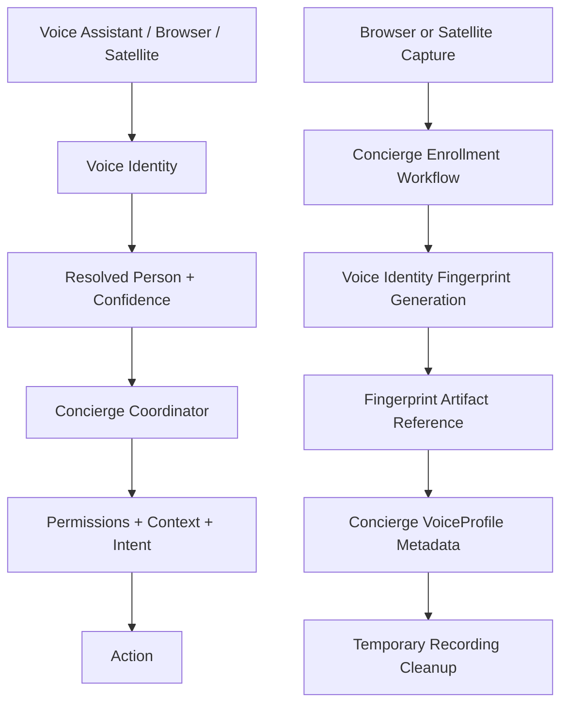

# Canonical Architecture

## Purpose

This document defines the authoritative system architecture for Homes That Behave Well.

It describes:

- system layers
- responsibilities
- data flow
- rules of interaction

This is the source of truth for how the system is built.

---

## Core Principle

The system is layered and deterministic.

Each layer has a single responsibility.

No layer may take on the responsibility of another.

---

## Platform Responsibility Model

Homes That Behave Well operates as a multi-repository platform with peer services.

| Platform Service | Owns | Answers |
|---|---|---|
| Foundation | rooms, spaces, devices, presence, occupancy, environmental state, source-of-truth platform facts | What is true? |
| Asset Intelligence | assets, metadata, constraints, protection rules, care intelligence, asset risk/care summaries | What matters? |
| Voice Identity | fingerprint generation, fingerprint artifacts and references, quality, model/version metadata, runtime attribution outputs | Who is interacting? |
| Concierge | people configuration, permissions, room and conversation context, coordinator, intent and response routing, UX | What should happen? |

Conceptual platform diagram:

Interaction and enrollment flows:

---

## Shared Identity Vocabulary

Identity and voice terms must be used consistently across the platform.

Authoritative reference:

- [docs/architecture/identity-governance-reference.md](identity-governance-reference.md)
- [docs/architecture/adr-voice-identity-platform-service.md](adr-voice-identity-platform-service.md)

Key terms:

- Identity Context: the current person-aware context used by Concierge
- Person Profile: the Home Assistant-person-based preference record for style and behavior
- Voice Profile: the enrolled speaker record used for speaker attribution
- Speaker Attribution Snapshot: the runtime match result for a speech event
- Interaction Style Context: the current delivery style chosen for the active person
- Listening Area: the arbitration area used to decide which assistant should respond
- Interaction Space: the active room or merged area where interaction is happening
- Local-first: keep identity and voice data inside the home network by default

Authoritative sub-architecture references:

- [docs/architecture/news-context-and-briefing-architecture.md](news-context-and-briefing-architecture.md)
- [docs/architecture/adr-voice-identity-platform-service.md](adr-voice-identity-platform-service.md)
- [docs/architecture/voice-profile-enrollment-architecture.md](voice-profile-enrollment-architecture.md)
- [docs/architecture/voice-enrollment-lifecycle-and-state-machine.md](voice-enrollment-lifecycle-and-state-machine.md)
- [docs/architecture/voice-enrollment-storage-cleanup-and-retention-architecture.md](voice-enrollment-storage-cleanup-and-retention-architecture.md)
- [docs/architecture/voice-enrollment-privacy-and-data-handling-policy.md](voice-enrollment-privacy-and-data-handling-policy.md)
- [docs/architecture/voice-profile-lifecycle-management.md](voice-profile-lifecycle-management.md)
- [docs/models/voice-enrollment-domain-model.md](../models/voice-enrollment-domain-model.md)
- [docs/patterns/temporary-artifact-lifecycle-pattern.md](../patterns/temporary-artifact-lifecycle-pattern.md)

---

## Voice Enrollment Architecture Reference

This section defines the implementation governance map for Concierge enrollment orchestration and Voice Identity fingerprint lifecycle integration.

### Document Index And Reading Guide

| Document | Purpose | Authority Level | When To Read | Decisions Governed |
|---|---|---|---|---|
| [docs/architecture/adr-voice-identity-platform-service.md](adr-voice-identity-platform-service.md) | Records platform boundary for Voice Identity as a peer service | Highest for cross-service identity scope | First for identity/enrollment architecture work | Identity ownership boundaries and integration responsibilities |
| [docs/architecture/adr-voice-profile-enrollment-architecture.md](adr-voice-profile-enrollment-architecture.md) | Records accepted architecture and rejected alternatives | Highest for enrollment scope | First, before planning or coding | Non-negotiable boundaries and defaults |
| [docs/architecture/voice-profile-enrollment-architecture.md](voice-profile-enrollment-architecture.md) | Canonical end-to-end enrollment architecture | Primary architecture authority | Immediately after ADR | Provider model, scope, authority boundaries |
| [docs/models/voice-enrollment-domain-model.md](../models/voice-enrollment-domain-model.md) | Domain ownership and responsibilities | Primary model authority | Before module design | Session, cleanup, storage, provider ownership |
| [docs/architecture/voice-enrollment-privacy-and-data-handling-policy.md](voice-enrollment-privacy-and-data-handling-policy.md) | Privacy and data handling policy | Policy authority | Before storage/diagnostics/repairs work | Data classification, consent, retention, telemetry bounds |
| [docs/architecture/voice-enrollment-lifecycle-and-state-machine.md](voice-enrollment-lifecycle-and-state-machine.md) | Lifecycle states and transition rules | Lifecycle authority | Before orchestration work | Transition validity, cleanup-gated terminal behavior |
| [docs/architecture/voice-enrollment-storage-cleanup-and-retention-architecture.md](voice-enrollment-storage-cleanup-and-retention-architecture.md) | Storage and cleanup architecture | Storage and cleanup authority | Before storage or cleanup design | External storage rules, manifest lifecycle, idempotent cleanup |
| [docs/architecture/voice-profile-lifecycle-management.md](voice-profile-lifecycle-management.md) | Profile output lifecycle boundaries | Profile lifecycle authority | Before profile operations work | Create, replace, revoke, delete boundaries |
| [docs/patterns/temporary-artifact-lifecycle-pattern.md](../patterns/temporary-artifact-lifecycle-pattern.md) | Reusable temporary-artifact pattern | Pattern authority | Before cleanup and reconciliation implementation | Create-track-process-commit-cleanup-verify pattern compliance |
| [docs/architecture/implementation-verification-checklist.md](implementation-verification-checklist.md) | Pre-coding verification gate | Readiness authority | Before first code change and before phase exits | Repo fact checks and risk controls |
| [docs/architecture/voice-enrollment-modernization-roadmap.md](voice-enrollment-modernization-roadmap.md) | Phased implementation sequencing | Planning authority | After architecture alignment is complete | Execution phases and phase exit criteria |

### Authoritative Reading Order

1. [docs/architecture/adr-voice-profile-enrollment-architecture.md](adr-voice-profile-enrollment-architecture.md)
2. [docs/architecture/adr-voice-identity-platform-service.md](adr-voice-identity-platform-service.md)
3. [docs/architecture/voice-profile-enrollment-architecture.md](voice-profile-enrollment-architecture.md)
4. [docs/models/voice-enrollment-domain-model.md](../models/voice-enrollment-domain-model.md)
5. [docs/architecture/voice-enrollment-privacy-and-data-handling-policy.md](voice-enrollment-privacy-and-data-handling-policy.md)
6. [docs/architecture/voice-enrollment-lifecycle-and-state-machine.md](voice-enrollment-lifecycle-and-state-machine.md)
7. [docs/architecture/voice-enrollment-storage-cleanup-and-retention-architecture.md](voice-enrollment-storage-cleanup-and-retention-architecture.md)
8. [docs/architecture/voice-profile-lifecycle-management.md](voice-profile-lifecycle-management.md)
9. [docs/patterns/temporary-artifact-lifecycle-pattern.md](../patterns/temporary-artifact-lifecycle-pattern.md)
10. [docs/architecture/implementation-verification-checklist.md](implementation-verification-checklist.md)
11. [docs/architecture/voice-enrollment-modernization-roadmap.md](voice-enrollment-modernization-roadmap.md)

### Source Of Truth Hierarchy

ADR
  -> Architecture
  -> Contracts
  -> Models
  -> Patterns
  -> Implementation

Conflict resolution rules:

- ADR wins over all lower layers.
- Architecture wins over contracts, models, and patterns when ADR is silent.
- Contracts cannot violate architecture or policy.
- Models cannot violate architecture or policy.
- Patterns guide implementation shape but cannot weaken governance rules.
- Existing implementation behavior does not override authoritative documentation.

---

## Platform Development Standards

All integrations and components in this system must follow strict development standards.

These standards are non-optional and apply to all code, architecture, and releases.

---

### Home Assistant Compliance

All implementations must follow Home Assistant standards and best practices.

This includes:

- integration architecture patterns
- entity design guidelines
- config flow and options flow usage
- device and entity registry usage
- service registration patterns

Before introducing any new logic or pattern:

- the implementation must be checked against Home Assistant best practices
- custom patterns must not replace native patterns without justification

Area and room source-of-truth rule:

- Home Assistant Area registry is authoritative for room definitions.
- Concierge and related integrations must project from Areas and extend them by `area_id`.
- Implementations must not introduce a parallel room-definition datastore that can drift from Home Assistant Areas.
- Area add/remove operations in Home Assistant must be reflected automatically in Concierge room views.

---

### Home Assistant UI and UX Standards

All user interface elements must follow Home Assistant UI patterns and design guidelines.

This includes:

- dialogs (popups)
- buttons and actions
- forms and configuration flows
- selectors (area, entity, device, etc.)
- layout and visual presentation

---

### UI Behavior Rules

The system must:

- use native Home Assistant dialogs and flows
- use built-in selectors instead of custom inputs when available
- follow Home Assistant interaction patterns for confirmation and actions

The system must not:

- create custom dialog frameworks
- introduce non-standard interaction patterns
- bypass Home Assistant UI components without strong justification

---

### Button and Action Standards

Buttons must follow Home Assistant conventions:

- primary actions use default button styling
- destructive actions must be clearly indicated (e.g., delete)
- confirmation must be required for irreversible actions

Actions must:

- be predictable
- be clearly labeled
- match Home Assistant terminology

---

### Color and Visual Standards

The system must:

- use Home Assistant theme-defined colors
- avoid hardcoded colors
- rely on UI components for styling

The system must not:

- define custom color schemes
- use color to convey meaning without following HA patterns
- override platform styling

---

### Layout and Structure

Interfaces must:

- align with Home Assistant panel and card layouts
- use consistent grouping of sections
- follow standard spacing and hierarchy

The system must not:

- introduce custom layout systems
- break visual consistency with Home Assistant

---

### User Experience Principle

The system must feel like a native Home Assistant integration.

Users should not be able to distinguish:

- where Home Assistant ends
- and where this integration begins

---

### Copilot Guidance Rule

When generating UI or interaction code, Copilot must:

- prefer Home Assistant native components
- reuse existing patterns from standard integrations
- avoid inventing new interaction models

If a UI implementation deviates from Home Assistant standards, it must be rejected.

### Platinum-Level Integration Goal

All integrations must be designed toward Home Assistant Platinum-level quality.

This includes:

- full config flow support
- options flow support
- device and entity registry integration
- diagnostics support
- structured logging
- error handling and graceful degradation
- test coverage for core functionality

The system must favor:

- completeness over speed
- correctness over shortcuts
- long-term maintainability over rapid delivery

---

### Testing and Quality Requirements

All integrations must include testing.

At minimum:

- unit tests for core logic
- validation of service inputs
- regression protection for key flows

Testing must ensure:

- deterministic behavior
- no breaking changes across releases
- consistent evaluation outcomes

---

### HACS Distribution Compliance

All integrations are distributed through HACS.

This requires:

- valid hacs.json configuration
- proper repository structure
- versioned releases
- successful GitHub Actions runs

Each release must include:

- passing HACS validation action
- passing Home Assistant validation (hassfest)
- properly tagged GitHub release

---

### Release Workflow

Every release must follow:

Code change → Commit → Validation (tests + actions) → GitHub Release → HACS availability

Rules:

- no manual file drops into Home Assistant
- no unvalidated releases
- no bypassing CI checks

---

### Copilot Guidance Rules

When generating or modifying code, Copilot must:

- prefer Home Assistant-native patterns
- avoid introducing custom frameworks unnecessarily
- validate design choices against HA best practices
- ensure compatibility with HACS requirements

If a suggestion conflicts with:

- Home Assistant standards
- Platinum-level expectations
- HACS requirements

The suggestion must be rejected.

---

### Final Principle

If a change:

- does not align with Home Assistant standards
- does not move toward Platinum-level quality
- cannot be released through HACS

It must not be implemented.

---

## System Layers

The system consists of five primary layers:

1. Store (System of Record)
2. Environment Model (Sensing)
3. Evaluation Engine (Decision)
4. Coordinator (Runtime Orchestration)
5. Entities and Interaction (Projection and UX)

---

## 1. Store (System of Record)

The store is the authoritative source of all persistent data.

### Responsibilities

- store assets
- store room configuration
- store environment requirements
- store audit and event history
- enforce schema structure

### Rules

- store does not evaluate
- store does not read sensors
- store does not make decisions
- store only persists and retrieves data

## External Storage Policy

Not all data belongs inside Home Assistant.

The system must distinguish between:

- runtime state (Home Assistant)
- structured metadata (store)
- external artifacts (network storage)

---

### Home Assistant Scope

Home Assistant is used for:

- entity state
- integration runtime
- lightweight structured data
- system orchestration

Home Assistant must not be used for:

- large file storage
- binary artifacts
- high-volume document storage
- unbounded historical data

---

### Store Scope

The Asset Intelligence store is used for:

- structured asset records
- environment configuration
- requirements and policy
- audit metadata
- document references

The store must not:

- store large binary data
- embed file contents
- depend on local filesystem structure

---

### External Storage Scope

External or network-connected storage is required for:

- documents (PDFs, images, scans)
- media files
- large exports
- historical archives beyond bounded limits

Federated audit archive pattern:

- keep native integration logs in their original systems as source-of-truth
- maintain a stitched activity index that references those native records
- when exporting offline archives, produce self-contained readable packages that include normalized summaries, outcomes, and key references
- avoid full raw-log duplication unless explicitly required by policy or legal/compliance need

Supported storage may include:

- local network storage (NAS)
- external file systems
- cloud storage providers

---

### Design Rules

If a data element:

- is large
- is binary
- is unbounded in growth
- is not part of Home Assistant entity state

It must be stored externally.

---

### Reference Model

The system must store only references to external data.

Example:

asset:
  documents:
    - document_id
      provider
      reference_path

The system must:

- resolve documents through a storage abstraction layer
- avoid direct file system coupling
- ensure portability across environments

---

### Availability Handling

External storage must be treated as optional but explicit capability.

If storage is:

AVAILABLE
- full document functionality is enabled

UNAVAILABLE
- document operations must be disabled
- no partial writes may occur

DEGRADED
- system must fail gracefully
- no data corruption allowed

---

### Integration Rule

All document and file operations must go through:

document_storage abstraction layer

No other component may:

- access files directly
- assume file paths
- perform file I/O

---

### Final Principle

If the data is not inherently part of Home Assistant’s state model, it does not belong inside Home Assistant.

It must be externalized and accessed through a controlled abstraction layer.

---

## 2. Environment Model (Sensing Layer)

The environment model represents current room conditions.

### Responsibilities

- read sensor data from Home Assistant
- normalize all signals into a structured environment snapshot
- compute confidence and source status
- include spatial context (windows)

### Rules

- must not evaluate risk
- must not mutate data
- must always return a valid structure
- must be deterministic for given inputs

---

## 3. Evaluation Engine (Decision Layer)

The evaluation engine determines asset condition.

### Responsibilities

- compare environment snapshot to asset requirements
- produce risk state
- produce reasons for the result

### Rules

- must be pure and deterministic
- must not mutate state
- must not access Home Assistant directly
- must not perform persistence

---

## 4. Coordinator (Runtime Orchestration)

The coordinator is the runtime brain of the system.

### Responsibilities

- build one environment snapshot per room
- evaluate all assets against that snapshot
- apply debounce and transition logic
- generate events
- maintain in-memory projections
- notify entities

### Rules

- must be the only place where state transitions occur
- must manage all event generation
- must not define evaluation rules
- must not read sensors directly

---

## 5. Entities and Interaction

Entities expose system state to Home Assistant.

Concierge handles interaction and orchestration.

### Responsibilities

Entities:

- display current state
- expose projections
- remain lightweight

Concierge:

- handle communication
- orchestrate services
- manage user interaction

### Rules

Entities must not:

- perform evaluation
- store data
- contain history

Concierge must not:

- own data
- bypass services
- perform domain evaluation

---

## Supporting Models

The system is supported by four core models:

- Asset Model
- Room Model
- Environment Model
- Exposure Model

Each model has a defined role and must not overlap.

---
### Exposure Model Clarification

Exposure is a runtime model computed during the environment interpretation phase.

It combines:

- environment conditions
- window orientation
- asset placement
- external context (such as sun position)

Exposure is not a separate architectural layer.

It is:

- computed deterministically each cycle
- used as input to evaluation
- not stored in the system of record

---

## Data Flow

The system follows a strict flow:

Sensor Data → Environment Model → Evaluation Engine → Coordinator → Store → Entities

### Rules

- each step must be deterministic
- no step may skip another
- all writes must go through the store

---

## Service Flow

All mutations follow this pattern:

Service Call → Validation → Store Write → Coordinator Refresh

### Rules

- no direct store mutation
- no bypassing validation
- no partial writes

---

## Event Model

Events represent all meaningful system changes.

### Event Sources

- coordinator (primary)
- service calls
- configuration changes

### Rules

- events must be immutable
- events must be structured
- events must be timestamped
- events must be bounded (history limits)

---

## Exposure Integration

Exposure is a runtime model that enhances evaluation context.

### Responsibilities

- combine environment, windows, placement, and sun context
- provide directional and exposure signals

### Rules

- must not be stored
- must be recalculated each cycle
- must remain explainable

---

## Advisory Layer

Advisory provides recommendations but does not act.

### Responsibilities

- suggest improvements
- explain system behavior
- guide user decisions

### Rules

- must not mutate state
- must not override evaluation
- must be explainable

---
## Contract Enforcement (Future Phase)

Contracts defined in this repository are currently human-readable.

In a future phase, these contracts should be enforced using:

- versioned schemas (e.g., JSON Schema)
- CI validation checks
- service payload validation

This will ensure:

- Asset Intelligence and Concierge remain synchronized
- breaking changes are detected early
- contract compliance is enforced automatically

Until then, contracts in this repository are the authoritative source of truth and must be followed strictly.

---
## Documentation Responsibility Model

Each document type has a distinct responsibility:

- Philosophy defines why the system behaves as it does
- Models define what data exists
- Contracts define boundaries between components
- Patterns define how behavior is implemented
- Architecture defines system structure and flow

Patterns may reflect philosophy, but must not redefine it.

Contracts must take precedence over patterns when conflicts arise.
---
## AI Integration

AI is an optional advisory enhancement.

### Responsibilities

- suggest configurations
- explain results
- generate recommendations

### Rules

- must not mutate system state
- must go through services
- must be validated
- must be explainable

---

## Failure Handling

The system must degrade gracefully.

### Rules

- missing data reduces confidence
- system must not fail due to missing sensors
- system must always return valid output
- no partial state mutations allowed

---

## Architectural Guardrails

The system must never:

- evaluate inside entities
- persist inside evaluation
- read sensors outside the environment model
- mutate state outside services and coordinator
- allow AI to bypass validation

---

## Final Principle

The system must be:

- deterministic
- explainable
- stable
- predictable

If a feature violates these principles, it must not be implemented.