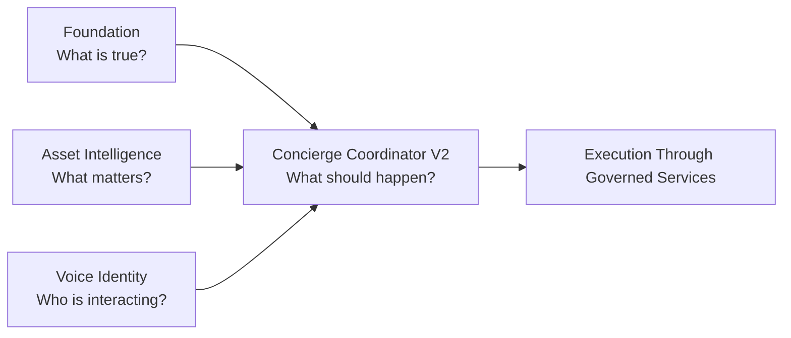

# Canonical Architecture

## Purpose

This document is the architecture of record for Homes That Behave Well (HTBW).

It defines:

- platform service boundaries
- source-of-record ownership
- coordinator execution boundaries
- cross-document architecture guardrails

This document governs architecture baseline alignment for E1 contract refactoring and E2 model refactoring.

---

## Authority Order

Authority is resolved in this order:

1. ADRs
2. Contracts
3. Models
4. Existing implementation
5. GitHub issue execution plans

Execution plans must not override ADRs, contracts, or models.

---

## Platform Responsibility Model

HTBW is a four-service platform.

| Platform Service | Canonical Responsibility | Canonical Question |
|---|---|---|
| Foundation | room, device, area, presence, occupancy, and environmental truth | What is true? |
| Asset Intelligence | asset significance, care, risk, and environmental relevance evaluation | What matters? |
| Voice Identity | voice attribution, confidence, and voice profile lifecycle | Who is interacting? |
| Concierge | orchestration, routing, planning, and household interaction decisioning | What should happen? |

No fifth platform service is introduced by this architecture.

---

## Ownership Boundaries

HTBW owns:

- architecture
- ADRs
- contracts
- models
- governance
- canonical definitions
- execution standards

Concierge owns:

- runtime orchestration and routing
- resolution and planning behavior
- execution behavior under governed contracts

Concierge does not own:

- governance authority
- source-of-record ownership
- canonical contract or model definition

---

## Coordinator V2 Constraint

Coordinator V2 is a consumer and orchestrator.

Authoritative governance ADR:

- [docs/architecture/adr-coordinator-v2-governance.md](adr-coordinator-v2-governance.md)
- [docs/architecture/adr-room-vocabulary-governance.md](adr-room-vocabulary-governance.md)
- [docs/architecture/adr-capability-projection-governance.md](adr-capability-projection-governance.md)
- [docs/architecture/adr-experience-model-governance.md](adr-experience-model-governance.md)
- [docs/architecture/adr-personalization-governance.md](adr-personalization-governance.md)
- [docs/architecture/adr-household-memory-governance.md](adr-household-memory-governance.md)
- [docs/architecture/adr-household-productivity-experience-governance.md](adr-household-productivity-experience-governance.md)
- [docs/architecture/adr-provenance-governance.md](adr-provenance-governance.md)
- [docs/architecture/adr-occupancy-and-presence-governance.md](adr-occupancy-and-presence-governance.md)
- [docs/architecture/adr-concierge-v1-capability-preservation-governance.md](adr-concierge-v1-capability-preservation-governance.md)

Coordinator V2 may consume governed context from:

- vocabulary
- capabilities
- experiences
- continuity
- affinity
- restoration
- occupancy
- presence
- provenance
- household memory
- productivity context
- message context

Coordinator V2 must not redefine:

- governance
- contracts
- models
- canonical definitions
- source-of-record ownership

---

## Source-Of-Record Boundaries

| Domain | Source Of Record | Concierge Role |
|---|---|---|
| Room, area, device, occupancy truth | Foundation | Consume and orchestrate |
| Asset significance and care evaluation | Asset Intelligence | Consume and route outcomes |
| Voice attribution and confidence | Voice Identity | Consume confidence and route behavior |
| Calendar state | Calendar provider(s) | Consume via governed interfaces |
| Email state | Email provider(s) | Consume via governed interfaces |
| Task and shopping state | Configured task and shopping providers | Consume via governed interfaces |

Concierge is not a replacement system of record for any external provider domain.

---

## Shared Identity Vocabulary

Identity and voice terms must be used consistently across the platform.

Authoritative references:

- [docs/architecture/identity-governance-reference.md](identity-governance-reference.md)
- [docs/architecture/adr-voice-identity-platform-service.md](adr-voice-identity-platform-service.md)

Key terms:

- Identity Context
- Person Profile
- Voice Profile
- Speaker Attribution Snapshot
- Interaction Style Context
- Listening Area
- Interaction Space
- Local-first

---

## Voice Enrollment Architecture Reference

This section preserves the architecture governance map for Concierge enrollment orchestration and Voice Identity lifecycle integration.

### Document Index And Reading Guide

| Document | Purpose | Authority Level |
|---|---|---|
| [docs/architecture/adr-voice-identity-platform-service.md](adr-voice-identity-platform-service.md) | Platform boundary for Voice Identity as peer service | Highest for cross-service identity scope |
| [docs/architecture/adr-voice-profile-enrollment-architecture.md](adr-voice-profile-enrollment-architecture.md) | Accepted enrollment architecture and rejected alternatives | Highest for enrollment scope |
| [docs/architecture/voice-profile-enrollment-architecture.md](voice-profile-enrollment-architecture.md) | Canonical end-to-end enrollment architecture | Primary architecture authority |
| [docs/models/voice-enrollment-domain-model.md](../models/voice-enrollment-domain-model.md) | Domain ownership and responsibilities | Primary model authority |
| [docs/architecture/voice-enrollment-privacy-and-data-handling-policy.md](voice-enrollment-privacy-and-data-handling-policy.md) | Privacy and data handling policy | Policy authority |
| [docs/architecture/voice-enrollment-lifecycle-and-state-machine.md](voice-enrollment-lifecycle-and-state-machine.md) | Lifecycle states and transitions | Lifecycle authority |
| [docs/architecture/voice-enrollment-storage-cleanup-and-retention-architecture.md](voice-enrollment-storage-cleanup-and-retention-architecture.md) | Storage and cleanup architecture | Storage and cleanup authority |
| [docs/architecture/voice-profile-lifecycle-management.md](voice-profile-lifecycle-management.md) | Profile output lifecycle boundaries | Profile lifecycle authority |
| [docs/patterns/temporary-artifact-lifecycle-pattern.md](../patterns/temporary-artifact-lifecycle-pattern.md) | Temporary-artifact lifecycle pattern | Pattern authority |
| [docs/architecture/implementation-verification-checklist.md](implementation-verification-checklist.md) | Pre-coding verification gate | Readiness authority |
| [docs/architecture/voice-enrollment-modernization-roadmap.md](voice-enrollment-modernization-roadmap.md) | Phased implementation sequencing | Planning authority |

### Authoritative Reading Order

1. [docs/architecture/adr-voice-profile-enrollment-architecture.md](adr-voice-profile-enrollment-architecture.md)
2. [docs/architecture/adr-voice-identity-platform-service.md](adr-voice-identity-platform-service.md)
3. [docs/architecture/voice-profile-enrollment-architecture.md](voice-profile-enrollment-architecture.md)
4. [docs/models/voice-enrollment-domain-model.md](../models/voice-enrollment-domain-model.md)
5. [docs/architecture/voice-enrollment-privacy-and-data-handling-policy.md](voice-enrollment-privacy-and-data-handling-policy.md)
6. [docs/architecture/voice-enrollment-lifecycle-and-state-machine.md](voice-enrollment-lifecycle-and-state-machine.md)
7. [docs/architecture/voice-enrollment-storage-cleanup-and-retention-architecture.md](voice-enrollment-storage-cleanup-and-retention-architecture.md)
8. [docs/architecture/voice-profile-lifecycle-management.md](voice-profile-lifecycle-management.md)
9. [docs/patterns/temporary-artifact-lifecycle-pattern.md](../patterns/temporary-artifact-lifecycle-pattern.md)
10. [docs/architecture/implementation-verification-checklist.md](implementation-verification-checklist.md)
11. [docs/architecture/voice-enrollment-modernization-roadmap.md](voice-enrollment-modernization-roadmap.md)

### Source Of Truth Hierarchy

ADR
  -> Architecture
  -> Contracts
  -> Models
  -> Patterns
  -> Implementation

Conflict-resolution rules:

- ADR wins over all lower layers.
- Architecture wins over contracts, models, and patterns when ADR is silent.
- Contracts cannot violate architecture or policy.
- Models cannot violate architecture or policy.
- Patterns guide implementation shape but cannot weaken governance rules.
- Existing implementation behavior does not override authoritative documentation.

---

## Platform Development Standards

### Home Assistant Compliance

All implementations must follow Home Assistant standards and best practices.

### Home Assistant UI And UX Standards

All user-facing UI must use Home Assistant native interaction patterns unless there is explicit architectural justification.

### Platinum-Level Integration Goal

All integrations should be designed toward Home Assistant Platinum-level quality.

The shared platform checklist is [docs/architecture/platinum-target-checklist.md](platinum-target-checklist.md).

The shared cross-repo governance gate framework is [docs/architecture/hacs-and-platinum-governance-standard.md](hacs-and-platinum-governance-standard.md).

### HACS Distribution Compliance

All integrations distributed through HACS must satisfy:

- valid `hacs.json`
- passing HACS validation
- passing Home Assistant validation (`hassfest`)
- properly tagged GitHub release

### Release Workflow

Code change -> Commit -> Validation (tests and actions) -> GitHub Release -> HACS availability

---

## Contract And Documentation Governance

### Contract Enforcement (Future Phase)

Contracts are currently human-readable architecture artifacts and should later be enforced through versioned schemas and CI validation.

### Documentation Responsibility Model

- Philosophy defines why.
- Models define what.
- Contracts define boundaries.
- Patterns define implementation shape.
- Architecture defines system structure and flow.

Contracts take precedence over patterns when conflicts arise.

---

## Architecture Guardrails

- Do not invent architecture outside ADR and contract authority.
- Do not redefine contracts or models in runtime docs.
- Do not move governance ownership from HTBW into Concierge.
- Do not create hidden inference that bypasses governed inputs.
- Preserve household-facing outcome continuity, not internal implementation parity.

Intentionally retired from canonical authority:

- legacy five-layer system framing used as platform authority

---

## Canonical Flow

---

## Concept Traceability Matrix

| Concept | Canonical Owner | Source Document(s) | Cross-Document References |
|---|---|---|---|
| Four-service platform model | HTBW governance | docs/architecture/canonical-architecture.md | docs/architecture/system-flow.md, docs/architecture/concierge-runtime-architecture.md |
| Foundation truth ownership | Foundation | docs/architecture/canonical-architecture.md, docs/contracts/service-contracts.md | docs/architecture/system-flow.md, docs/architecture/context-before-intent.md |
| Asset significance evaluation ownership | Asset Intelligence | docs/architecture/canonical-architecture.md, docs/contracts/service-contracts.md | docs/architecture/system-flow.md |
| Voice attribution and confidence ownership | Voice Identity | docs/architecture/adr-voice-identity-platform-service.md, docs/architecture/identity-governance-reference.md | docs/architecture/concierge-runtime-architecture.md, docs/architecture/context-before-intent.md |
| Concierge orchestration ownership | Concierge | docs/contracts/concierge-contract.md, docs/architecture/concierge-runtime-architecture.md | docs/architecture/system-flow.md, docs/architecture/context-before-intent.md |
| Coordinator V2 as consumer and orchestrator | Concierge (runtime role under HTBW governance) | docs/architecture/adr-coordinator-v2-governance.md, docs/architecture/concierge-runtime-architecture.md | docs/architecture/system-flow.md, docs/architecture/context-before-intent.md |
| Room vocabulary governance | HTBW governance referencing Foundation room truth | docs/architecture/adr-room-vocabulary-governance.md, docs/contracts/room-awareness-contract.md, docs/contracts/composite-room-contract.md, docs/models/room-model.md | docs/architecture/context-before-intent.md |
| Capability projection governance | HTBW governance with contract and model authority retained | docs/architecture/adr-capability-projection-governance.md, docs/contracts/service-contracts.md, docs/contracts/concierge-contract.md | docs/architecture/concierge-runtime-architecture.md, docs/contracts/performance-contract.md |
| Experience model governance | HTBW governance with contract and model authority retained | docs/architecture/adr-experience-model-governance.md, docs/models/interaction-model.md, docs/contracts/concierge-global-context-contract.md | docs/architecture/concierge-runtime-architecture.md, docs/architecture/context-before-intent.md |
| Personalization governance | HTBW governance with identity and profile boundary authority retained | docs/architecture/adr-personalization-governance.md, docs/contracts/person-identity-contract.md, docs/models/person-profile-model.md | docs/architecture/identity-governance-reference.md, docs/architecture/concierge-runtime-architecture.md, docs/architecture/context-before-intent.md |
| Household memory governance | HTBW governance with event, signal, identity, and provenance boundaries retained | docs/architecture/adr-household-memory-governance.md, docs/models/event-model.md, docs/models/signal-model.md, docs/architecture/identity-governance-reference.md | docs/architecture/adr-personalization-governance.md, docs/architecture/adr-experience-model-governance.md |
| Household productivity experience governance | HTBW governance with provider source-of-record boundaries retained | docs/architecture/adr-household-productivity-experience-governance.md, docs/contracts/concierge-global-context-contract.md, docs/contracts/concierge-contract.md, docs/models/interaction-model.md | docs/architecture/adr-experience-model-governance.md, docs/architecture/adr-personalization-governance.md, docs/architecture/adr-household-memory-governance.md |
| Provenance governance | HTBW governance with lineage and attribution boundaries retained | docs/architecture/adr-provenance-governance.md, docs/models/event-model.md, docs/contracts/service-contracts.md, docs/architecture/identity-governance-reference.md | docs/architecture/adr-household-memory-governance.md, docs/architecture/adr-household-productivity-experience-governance.md, docs/architecture/adr-coordinator-v2-governance.md |
| Occupancy and presence governance | HTBW governance with Foundation truth and Voice Identity confidence boundaries retained | docs/architecture/adr-occupancy-and-presence-governance.md, docs/contracts/person-identity-contract.md, docs/contracts/concierge-scope-contract.md, docs/architecture/context-before-intent.md | docs/architecture/adr-personalization-governance.md, docs/architecture/adr-household-memory-governance.md, docs/architecture/adr-provenance-governance.md |
| Concierge V1 household-facing outcome preservation governance | HTBW governance baseline for V2 non-regression parity and E3a readiness gating | docs/architecture/adr-concierge-v1-capability-preservation-governance.md, docs/contracts/composite-room-contract.md, docs/contracts/concierge-scope-contract.md, docs/contracts/performance-contract.md, docs/contracts/concierge-global-context-contract.md | docs/architecture/adr-coordinator-v2-governance.md, docs/architecture/adr-room-vocabulary-governance.md, docs/architecture/adr-occupancy-and-presence-governance.md |
| HACS and Platinum governance gates | HTBW governance standard for continuous quality and readiness gates across roadmap phases | docs/architecture/hacs-and-platinum-governance-standard.md, docs/architecture/platinum-target-checklist.md, docs/architecture/implementation-verification-checklist.md, docs/contracts/service-contracts.md | docs/architecture/canonical-architecture.md, docs/philosophy/homes-that-behave-well.md |
| E1 Concierge contract baseline alignment | HTBW contract baseline artifact for V2 contract boundary clarity and E2 model-readiness consumption | docs/contracts/v2-c1-contract-refactor-baseline.md, docs/contracts/concierge-contract.md, docs/contracts/service-contracts.md | docs/architecture/canonical-architecture.md, docs/models/interaction-model.md |
| E2 model-alignment baseline | HTBW baseline traceability for authoritative room, person profile, interaction, event, environment, and signal model alignment to completed E1 contracts | docs/contracts/v2-c1-contract-refactor-baseline.md, docs/contracts/room-interaction-contract.md, docs/contracts/room-vocabulary-registry-contract.md, docs/contracts/capability-projection-contract.md, docs/contracts/experience-projection-contract.md, docs/contracts/person-continuity-affinity-contract.md, docs/contracts/experience-restoration-contract.md, docs/contracts/household-memory-contract.md, docs/contracts/calendar-email-experience-contract.md, docs/contracts/task-shopping-experience-contract.md, docs/contracts/knowledge-briefing-status-synthesis-contract.md, docs/contracts/multi-item-capture-interpretation-contract.md, docs/contracts/provenance-contract.md, docs/contracts/occupancy-and-presence-contract.md, docs/architecture/hacs-platinum-contract-compliance-checklist.md | docs/models/room-model.md, docs/models/person-profile-model.md, docs/models/interaction-model.md, docs/models/event-model.md, docs/models/environment-model.md, docs/models/signal-model.md |
| Room interaction governance boundary | HTBW contract authority for room, merged, composite, and floor interaction behavior under preserved ownership boundaries | docs/contracts/room-interaction-contract.md, docs/contracts/room-awareness-contract.md, docs/contracts/composite-room-contract.md, docs/contracts/concierge-scope-contract.md | docs/architecture/context-before-intent.md, docs/models/room-model.md, docs/models/interaction-model.md |
| Room vocabulary registry governance boundary | HTBW contract authority for room terminology, alias, scope, merged, and composite vocabulary governance consumed by interaction and projections | docs/contracts/room-vocabulary-registry-contract.md, docs/architecture/adr-room-vocabulary-governance.md, docs/contracts/room-interaction-contract.md, docs/contracts/concierge-scope-contract.md | docs/models/room-model.md, docs/models/interaction-model.md, docs/architecture/context-before-intent.md |
| Room Vocabulary Registry model governance boundary | HTBW model authority for vocabulary entries, aliases, capability mappings, conflict indicators, room relationships, and explainability references consumed by Room Context Resolution, Composite Room Handling, Capability Projection, and Experience Planning | docs/models/room-vocabulary-registry-model.md, docs/contracts/room-vocabulary-registry-contract.md, docs/models/room-model.md, docs/contracts/v2-c1-contract-refactor-baseline.md | docs/contracts/room-interaction-contract.md, docs/models/capability-projection-model.md, docs/models/experience-model.md, docs/contracts/concierge-scope-contract.md |
| Capability projection governance boundary | HTBW contract authority for capability visibility, availability, discoverability, and projection explainability across room and scope contexts | docs/contracts/capability-projection-contract.md, docs/architecture/adr-capability-projection-governance.md, docs/contracts/room-interaction-contract.md, docs/contracts/room-vocabulary-registry-contract.md | docs/models/interaction-model.md, docs/contracts/concierge-contract.md, docs/architecture/context-before-intent.md |
| Capability Projection model governance boundary | HTBW model authority for capability projection result shape, available, filtered, unsupported, explainability, and lineage references consumed by Coordinator V2 and Experience Projection | docs/models/capability-projection-model.md, docs/contracts/capability-projection-contract.md, docs/contracts/experience-projection-contract.md, docs/contracts/v2-c1-contract-refactor-baseline.md | docs/contracts/room-interaction-contract.md, docs/models/room-model.md, docs/models/person-profile-model.md, docs/models/occupancy-presence-model.md |
| Experience model governance boundary | HTBW model authority for experience categories, relationships, visibility-state representation, explainability references, and consumption-only planning inputs consumed by Coordinator V2, Restoration Planning, Productivity Experience Planning, and Experience Projection | docs/models/experience-model.md, docs/contracts/experience-projection-contract.md, docs/models/capability-projection-model.md, docs/contracts/v2-c1-contract-refactor-baseline.md | docs/models/room-model.md, docs/models/person-profile-model.md, docs/contracts/experience-restoration-contract.md, docs/contracts/calendar-email-experience-contract.md, docs/contracts/task-shopping-experience-contract.md, docs/contracts/knowledge-briefing-status-synthesis-contract.md |
| Experience projection governance boundary | HTBW contract authority for experience visibility, discoverability, composition, availability, and explainability across room, person, scope, and memory contexts | docs/contracts/experience-projection-contract.md, docs/architecture/adr-experience-model-governance.md, docs/contracts/capability-projection-contract.md, docs/contracts/room-interaction-contract.md, docs/contracts/room-vocabulary-registry-contract.md | docs/models/interaction-model.md, docs/models/person-profile-model.md, docs/models/event-model.md, docs/architecture/context-before-intent.md |
| Person continuity and affinity governance boundary | HTBW contract authority for continuity eligibility, continuity visibility, affinity visibility, consent-bounded influence, guest-safe protections, and explainability across person and room context | docs/contracts/person-continuity-affinity-contract.md, docs/architecture/adr-personalization-governance.md, docs/architecture/adr-household-memory-governance.md, docs/contracts/person-identity-contract.md, docs/contracts/experience-projection-contract.md | docs/models/person-profile-model.md, docs/models/interaction-model.md, docs/models/event-model.md, docs/architecture/identity-governance-reference.md |
| Experience restoration governance boundary | HTBW contract authority for restoration eligibility, confidence gates, quiet-hours and posture policy influence, guest-safe restrictions, and restoration explainability across person, room, occupancy, continuity, affinity, and memory context | docs/contracts/experience-restoration-contract.md, docs/architecture/adr-experience-model-governance.md, docs/architecture/adr-personalization-governance.md, docs/architecture/adr-occupancy-and-presence-governance.md, docs/contracts/person-continuity-affinity-contract.md | docs/models/interaction-model.md, docs/models/person-profile-model.md, docs/models/event-model.md, docs/architecture/context-before-intent.md |
| Experience Restoration Context model governance boundary | HTBW model authority for restoration candidate representation, restoration context representation, restoration decision inputs, occupancy references, confidence references, and restoration explainability references consumed by E8 Experience Restoration Planning, Occupancy-Aware Planning, Restoration Explainability, and Restoration Suppression Analysis | docs/models/experience-restoration-context-model.md, docs/contracts/experience-restoration-contract.md, docs/contracts/occupancy-and-presence-contract.md, docs/contracts/v2-c1-contract-refactor-baseline.md | docs/models/person-profile-model.md, docs/models/person-continuity-model.md, docs/models/person-room-affinity-model.md, docs/models/experience-model.md, docs/models/occupancy-presence-model.md |
| Household memory contract governance boundary | HTBW contract authority for memory eligibility, visibility, explainability, privacy, retention, and retrieval boundaries derived from authoritative event history and provenance | docs/contracts/household-memory-contract.md, docs/architecture/adr-household-memory-governance.md, docs/architecture/adr-provenance-governance.md, docs/contracts/person-identity-contract.md, docs/contracts/person-continuity-affinity-contract.md | docs/models/event-model.md, docs/models/interaction-model.md, docs/models/person-profile-model.md, docs/architecture/identity-governance-reference.md |
| Occupancy and Presence contract governance boundary | HTBW contract authority for occupancy semantics, occupancy states, confidence governance, decision gates, guest-safe behavior, multi-person behavior, and explainability | docs/contracts/occupancy-and-presence-contract.md, docs/architecture/adr-occupancy-and-presence-governance.md, docs/contracts/person-identity-contract.md, docs/contracts/experience-restoration-contract.md, docs/contracts/household-memory-contract.md | docs/models/occupancy-presence-model.md, docs/models/room-model.md, docs/models/person-profile-model.md, docs/models/event-model.md, docs/models/interaction-model.md |
| Occupancy and Presence model governance boundary | HTBW model authority for occupancy state, occupancy confidence, identity confidence references, source references, guest-safe modeling, and explainability consumed by restoration, messaging, and household memory decisions | docs/models/occupancy-presence-model.md, docs/architecture/adr-occupancy-and-presence-governance.md, docs/contracts/person-identity-contract.md, docs/contracts/room-interaction-contract.md, docs/contracts/experience-restoration-contract.md | docs/models/room-model.md, docs/models/person-profile-model.md, docs/models/event-model.md, docs/models/signal-model.md, docs/architecture/identity-governance-reference.md |
| Person Continuity model governance boundary | HTBW model authority for continuity state representation, continuity references, continuity explainability references, and continuity relationships consumed by Restoration Planning, Experience Consumption, and Personalization Consumption | docs/models/person-continuity-model.md, docs/contracts/person-continuity-affinity-contract.md, docs/contracts/experience-restoration-contract.md, docs/contracts/v2-c1-contract-refactor-baseline.md | docs/models/person-profile-model.md, docs/models/room-model.md, docs/models/interaction-model.md, docs/models/experience-model.md, docs/models/occupancy-presence-model.md |
| Person-Room Affinity model governance boundary | HTBW model authority for affinity relationship representation, room preference representation, preference explainability references, and room-aware preference relationships consumed by E7 Person Affinity Planning, Restoration Planning, Messaging Consumption, and Room-Aware Experience Consumption | docs/models/person-room-affinity-model.md, docs/contracts/person-continuity-affinity-contract.md, docs/contracts/v2-c1-contract-refactor-baseline.md | docs/models/person-profile-model.md, docs/models/room-model.md, docs/models/person-continuity-model.md, docs/models/experience-model.md, docs/models/occupancy-presence-model.md |
| Provenance governance boundary | HTBW contract authority for attribution semantics, lineage, confidence, canonical provenance fields, and explainability across shopping, tasks, messages, reminders, memory, productivity writes, and coordination actions | docs/contracts/provenance-contract.md, docs/architecture/adr-provenance-governance.md, docs/contracts/household-memory-contract.md, docs/contracts/task-shopping-experience-contract.md, docs/contracts/multi-item-capture-interpretation-contract.md | docs/models/event-model.md, docs/models/interaction-model.md, docs/models/person-profile-model.md, docs/architecture/identity-governance-reference.md |
| Provenance model governance boundary | HTBW model authority for canonical provenance field representation, attribution representation, confidence representation, explanation source representation, and provenance relationships consumed by E10 Household Memory Planning, E13 Productivity Experiences, E14 Multi-Item Capture, and future attribution-aware planning | docs/models/provenance-model.md, docs/contracts/provenance-contract.md, docs/contracts/v2-c1-contract-refactor-baseline.md | docs/models/event-model.md, docs/models/interaction-model.md, docs/models/person-profile-model.md, docs/models/occupancy-presence-model.md |
| Household Memory model governance boundary | HTBW model authority for memory reference representation, memory relationship representation, memory explanation representation, and memory visibility references consumed by E10 Household Memory Planning, Memory-Aware Experiences, Memory-Aware Productivity Experiences, and Household Summarization | docs/models/household-memory-model.md, docs/contracts/household-memory-contract.md, docs/contracts/provenance-contract.md, docs/contracts/v2-c1-contract-refactor-baseline.md | docs/models/provenance-model.md, docs/models/event-model.md, docs/models/interaction-model.md, docs/models/person-profile-model.md, docs/models/room-model.md, docs/models/occupancy-presence-model.md |
| Calendar and Email experience governance boundary | HTBW contract authority for calendar and email experience visibility, discoverability, briefing participation, privacy, consent, explainability, and source attribution without source-of-record ownership | docs/contracts/calendar-email-experience-contract.md, docs/architecture/adr-household-productivity-experience-governance.md, docs/architecture/adr-experience-model-governance.md, docs/architecture/adr-provenance-governance.md, docs/contracts/household-memory-contract.md | docs/contracts/person-identity-contract.md, docs/models/event-model.md, docs/models/person-profile-model.md, docs/architecture/identity-governance-reference.md |
| Calendar Experience model governance boundary | HTBW model authority for calendar context representation, free/busy representation, household coordination references, briefing references, calendar explainability references, and guest-safe calendar visibility consumed by E13 Productivity Experiences, Briefing Generation, Household Coordination, and Productivity Synthesis | docs/models/calendar-experience-model.md, docs/contracts/calendar-email-experience-contract.md, docs/architecture/adr-household-productivity-experience-governance.md, docs/contracts/experience-projection-contract.md, docs/contracts/v2-c1-contract-refactor-baseline.md | docs/models/experience-model.md, docs/models/provenance-model.md, docs/models/household-memory-model.md, docs/models/person-profile-model.md, docs/models/room-model.md, docs/models/occupancy-presence-model.md |
| Email Experience model governance boundary | HTBW model authority for email awareness representation, importance indicator representation, summary reference representation, source attribution references, and guest-safe email visibility consumed by E13 Productivity Experiences, Briefing Generation, Email Awareness Experiences, and Productivity Synthesis | docs/models/email-experience-model.md, docs/contracts/calendar-email-experience-contract.md, docs/architecture/adr-household-productivity-experience-governance.md, docs/contracts/experience-projection-contract.md, docs/contracts/v2-c1-contract-refactor-baseline.md | docs/models/experience-model.md, docs/models/provenance-model.md, docs/models/household-memory-model.md, docs/models/person-profile-model.md, docs/models/room-model.md, docs/models/occupancy-presence-model.md |
| Task and Shopping experience governance boundary | HTBW contract authority for task and shopping experience visibility, assignment and completion awareness, duplicate handling expectations, briefing participation, privacy, consent, explainability, and source attribution without source-of-record ownership | docs/contracts/task-shopping-experience-contract.md, docs/architecture/adr-household-productivity-experience-governance.md, docs/architecture/adr-experience-model-governance.md, docs/architecture/adr-provenance-governance.md, docs/contracts/household-memory-contract.md | docs/contracts/person-identity-contract.md, docs/models/event-model.md, docs/models/person-profile-model.md, docs/architecture/identity-governance-reference.md |
| Task Experience model governance boundary | HTBW model authority for ownership representation, assignment representation, completion representation, due-awareness representation, provenance linkage references, task explainability references, and guest-safe task visibility consumed by E13 Productivity Experiences, Household Coordination, Briefing Experiences, and Productivity Synthesis | docs/models/task-experience-model.md, docs/contracts/task-shopping-experience-contract.md, docs/architecture/adr-household-productivity-experience-governance.md, docs/contracts/experience-projection-contract.md, docs/contracts/v2-c1-contract-refactor-baseline.md | docs/models/experience-model.md, docs/models/provenance-model.md, docs/models/household-memory-model.md, docs/models/person-profile-model.md, docs/models/room-model.md, docs/models/occupancy-presence-model.md |
| Shopping Experience model governance boundary | HTBW model authority for shopping item representation, ownership representation, duplicate indicator representation, completion representation, provenance linkage references, and guest-safe shopping visibility consumed by E13 Productivity Experiences, Household Coordination, Briefing Experiences, and Multi-Item Capture | docs/models/shopping-experience-model.md, docs/contracts/task-shopping-experience-contract.md, docs/architecture/adr-household-productivity-experience-governance.md, docs/contracts/experience-projection-contract.md, docs/contracts/v2-c1-contract-refactor-baseline.md | docs/models/experience-model.md, docs/models/provenance-model.md, docs/models/household-memory-model.md, docs/models/person-profile-model.md, docs/models/room-model.md, docs/models/occupancy-presence-model.md |
| Knowledge, Briefing, and Household Status Synthesis governance boundary | HTBW contract authority for knowledge responses, briefing composition, household status synthesis, calm-by-default ordering, guest-safe visibility, explainability, and provenance-bound source attribution | docs/contracts/knowledge-briefing-status-synthesis-contract.md, docs/architecture/adr-household-productivity-experience-governance.md, docs/architecture/adr-experience-model-governance.md, docs/architecture/adr-provenance-governance.md, docs/contracts/household-memory-contract.md, docs/contracts/task-shopping-experience-contract.md, docs/contracts/calendar-email-experience-contract.md | docs/models/event-model.md, docs/models/person-profile-model.md, docs/architecture/identity-governance-reference.md |
| Knowledge Query Experience model governance boundary | HTBW model authority for knowledge request representation, knowledge response representation, source reference representation, uncertainty reference representation, and knowledge explainability references consumed by E13 Productivity Experiences, Briefing Experiences, Household Status Synthesis, and Productivity Synthesis | docs/models/knowledge-query-experience-model.md, docs/contracts/knowledge-briefing-status-synthesis-contract.md, docs/architecture/adr-household-productivity-experience-governance.md, docs/contracts/v2-c1-contract-refactor-baseline.md, docs/contracts/experience-projection-contract.md | docs/models/experience-model.md, docs/models/provenance-model.md, docs/models/household-memory-model.md, docs/models/person-profile-model.md, docs/models/room-model.md, docs/models/occupancy-presence-model.md |
| Briefing Composition model governance boundary | HTBW model authority for briefing section representation, source reference representation, priority ordering representation, calm-by-default ordering representation, and briefing explainability references consumed by E13 Productivity Experiences, Briefing Experiences, Household Status Synthesis, and Coordination Experiences | docs/models/briefing-composition-model.md, docs/contracts/knowledge-briefing-status-synthesis-contract.md, docs/architecture/adr-household-productivity-experience-governance.md, docs/contracts/v2-c1-contract-refactor-baseline.md, docs/contracts/experience-projection-contract.md | docs/models/calendar-experience-model.md, docs/models/email-experience-model.md, docs/models/task-experience-model.md, docs/models/shopping-experience-model.md, docs/models/knowledge-query-experience-model.md, docs/models/provenance-model.md, docs/models/household-memory-model.md, docs/models/person-profile-model.md, docs/models/room-model.md, docs/models/occupancy-presence-model.md |
| Household Coordination contract governance boundary | HTBW contract authority for cross-domain household coordination awareness, coordination visibility semantics, coordination explainability semantics, person-aware and guest-safe coordination boundaries, and provenance consumption without source-of-record ownership transfer | docs/contracts/household-coordination-contract.md, docs/architecture/adr-household-productivity-experience-governance.md, docs/architecture/adr-experience-model-governance.md, docs/architecture/adr-provenance-governance.md, docs/contracts/calendar-email-experience-contract.md, docs/contracts/task-shopping-experience-contract.md, docs/contracts/knowledge-briefing-status-synthesis-contract.md, docs/contracts/household-memory-contract.md, docs/contracts/provenance-contract.md | docs/contracts/person-identity-contract.md, docs/models/person-profile-model.md, docs/models/room-model.md, docs/models/interaction-model.md, docs/models/event-model.md, docs/models/occupancy-presence-model.md |
| Household Coordination Snapshot model governance boundary | HTBW model authority for coordination snapshot representation, cross-domain coordination references, coordination visibility references, and coordination explainability references consumed by E14 Household Coordination, Coordination Experiences, Household Planning, and Household Status Synthesis | docs/models/household-coordination-snapshot-model.md, docs/contracts/household-coordination-contract.md, docs/contracts/knowledge-briefing-status-synthesis-contract.md, docs/architecture/adr-household-productivity-experience-governance.md, docs/contracts/v2-c1-contract-refactor-baseline.md | docs/models/calendar-experience-model.md, docs/models/task-experience-model.md, docs/models/shopping-experience-model.md, docs/models/email-experience-model.md, docs/models/briefing-composition-model.md, docs/models/knowledge-query-experience-model.md, docs/models/provenance-model.md, docs/models/household-memory-model.md, docs/models/person-profile-model.md, docs/models/room-model.md, docs/models/occupancy-presence-model.md |
| Multi-Item Capture Result model governance boundary | HTBW model authority for utterance representation, decomposition result representation, item lineage representation, provenance propagation references, and decomposition explainability references consumed by E13 Productivity Experiences, Task Creation Workflows, Shopping Creation Workflows, and Future Multi-Item Capture Consumption | docs/models/multi-item-capture-result-model.md, docs/contracts/multi-item-capture-interpretation-contract.md, docs/architecture/adr-household-productivity-experience-governance.md, docs/contracts/v2-c1-contract-refactor-baseline.md, docs/contracts/provenance-contract.md | docs/models/task-experience-model.md, docs/models/shopping-experience-model.md, docs/models/provenance-model.md, docs/models/household-memory-model.md, docs/models/person-profile-model.md, docs/models/interaction-model.md, docs/models/event-model.md, docs/models/occupancy-presence-model.md, docs/models/experience-model.md |
| Multi-Item Capture Interpretation governance boundary | HTBW contract authority for multi-item decomposition, provenance propagation, ambiguity handling, confirmation policy, and decomposition explainability for shopping and task capture workflows | docs/contracts/multi-item-capture-interpretation-contract.md, docs/architecture/adr-household-productivity-experience-governance.md, docs/architecture/adr-experience-model-governance.md, docs/architecture/adr-provenance-governance.md, docs/contracts/task-shopping-experience-contract.md, docs/contracts/household-memory-contract.md | docs/contracts/person-identity-contract.md, docs/models/interaction-model.md, docs/models/event-model.md, docs/architecture/identity-governance-reference.md |
| HACS and Platinum contract compliance governance boundary | HTBW final E1 contract-level quality gate for HACS readiness, Platinum readiness, diagnostics, repairability, privacy, explainability, and E12 consumption readiness | docs/architecture/hacs-platinum-contract-compliance-checklist.md, docs/architecture/hacs-and-platinum-governance-standard.md, docs/architecture/platinum-target-checklist.md, docs/architecture/implementation-verification-checklist.md, docs/contracts/provenance-contract.md, docs/contracts/occupancy-and-presence-contract.md | docs/contracts/v2-c1-contract-refactor-baseline.md, docs/contracts/experience-restoration-contract.md, docs/contracts/household-memory-contract.md, docs/contracts/task-shopping-experience-contract.md, docs/contracts/knowledge-briefing-status-synthesis-contract.md |
| Source-of-record external provider boundaries | External providers and platform peers | docs/architecture/canonical-architecture.md, docs/contracts/service-contracts.md | docs/architecture/system-flow.md, docs/architecture/identity-governance-reference.md |

---

## Architecture Consistency Review

### Conflicts Found

- Canonical architecture previously mixed platform authority with an Asset Intelligence-specific five-layer runtime stack.
- Ownership language had drift risk in some sections.

### Corrections Applied

- Retained strict four-service canonical model.
- Explicitly prohibited introduction of a fifth platform service.
- Preserved Coordinator V2 as consumer/orchestrator only.
- Restored authoritative ADR/contract/model governance references and compliance guidance.

### Unresolved Concerns

- None in this restoration pass.

---

## Final Principle

Architecture authority remains in HTBW.

Concierge Coordinator V2 consumes governed context and orchestrates execution.

E2 baseline models are aligned to the completed E1 contract architecture and must continue to consume it rather than redefine it.

Platform source-of-record ownership and four-service boundaries must remain explicit and unchanged.

Future E10 planning must treat [docs/architecture/adr-household-memory-governance.md](adr-household-memory-governance.md) as a mandatory dependency.

Future E8a planning must treat [docs/architecture/adr-occupancy-and-presence-governance.md](adr-occupancy-and-presence-governance.md) as a mandatory dependency.

Future E8 planning must treat [docs/architecture/adr-occupancy-and-presence-governance.md](adr-occupancy-and-presence-governance.md) as a mandatory dependency.

Future E9 planning must treat [docs/architecture/adr-occupancy-and-presence-governance.md](adr-occupancy-and-presence-governance.md) as a mandatory dependency.

Future E10 planning must treat [docs/architecture/adr-occupancy-and-presence-governance.md](adr-occupancy-and-presence-governance.md) as a mandatory dependency.

Future E3a planning must treat [docs/architecture/adr-concierge-v1-capability-preservation-governance.md](adr-concierge-v1-capability-preservation-governance.md) as a mandatory dependency.

Future E12 planning must treat [docs/architecture/hacs-and-platinum-governance-standard.md](hacs-and-platinum-governance-standard.md) as a mandatory dependency.

Future E12 closure evaluation must treat [docs/architecture/hacs-and-platinum-governance-standard.md](hacs-and-platinum-governance-standard.md) as a mandatory gate framework.

Future E2 model refactoring must treat [docs/contracts/v2-c1-contract-refactor-baseline.md](../contracts/v2-c1-contract-refactor-baseline.md) as a mandatory contract baseline dependency.

Future E4 planning must treat [docs/contracts/room-vocabulary-registry-contract.md](../contracts/room-vocabulary-registry-contract.md) as a mandatory dependency.

Future E4 planning must treat [docs/contracts/room-interaction-contract.md](../contracts/room-interaction-contract.md) as a mandatory dependency.

Future E4 planning must treat [docs/models/room-vocabulary-registry-model.md](../models/room-vocabulary-registry-model.md) as authoritative.

Future Capability Projection planning must treat [docs/models/room-vocabulary-registry-model.md](../models/room-vocabulary-registry-model.md) as authoritative.

Future Experience Planning must treat [docs/models/room-vocabulary-registry-model.md](../models/room-vocabulary-registry-model.md) as authoritative.

Future Composite Room Planning must treat [docs/models/room-vocabulary-registry-model.md](../models/room-vocabulary-registry-model.md) as authoritative.

Future E5 planning must treat [docs/contracts/capability-projection-contract.md](../contracts/capability-projection-contract.md) as a mandatory dependency.

Future E5 planning must treat [docs/contracts/room-interaction-contract.md](../contracts/room-interaction-contract.md) as a mandatory dependency.

Future E5 planning must treat [docs/models/capability-projection-model.md](../models/capability-projection-model.md) as a mandatory dependency.

Future Experience Projection planning must treat [docs/models/capability-projection-model.md](../models/capability-projection-model.md) as a mandatory dependency.

Future Coordinator V2 planning must treat [docs/models/capability-projection-model.md](../models/capability-projection-model.md) as a mandatory dependency.

Experience Model consumes Capability Projection Model and Experience Projection Contract authority.

Future E6 planning must treat [docs/models/experience-model.md](../models/experience-model.md) as authoritative.

Future Coordinator V2 planning must treat [docs/models/experience-model.md](../models/experience-model.md) as authoritative.

Future Restoration planning must treat [docs/models/experience-model.md](../models/experience-model.md) as authoritative.

Future Productivity Experience planning must treat [docs/models/experience-model.md](../models/experience-model.md) as authoritative.

Future E6 planning must treat [docs/contracts/experience-projection-contract.md](../contracts/experience-projection-contract.md) as a mandatory dependency.

Future E7 planning must treat [docs/contracts/person-continuity-affinity-contract.md](../contracts/person-continuity-affinity-contract.md) as a mandatory dependency.

Future E8 planning must treat [docs/contracts/person-continuity-affinity-contract.md](../contracts/person-continuity-affinity-contract.md) as a mandatory dependency.

Future E8 planning must treat [docs/contracts/experience-restoration-contract.md](../contracts/experience-restoration-contract.md) as a mandatory dependency.

Future E8a planning must treat [docs/contracts/person-continuity-affinity-contract.md](../contracts/person-continuity-affinity-contract.md) as a mandatory dependency.

Future E8a planning must treat [docs/contracts/experience-restoration-contract.md](../contracts/experience-restoration-contract.md) as a mandatory dependency.

Future E9 planning must treat [docs/contracts/person-continuity-affinity-contract.md](../contracts/person-continuity-affinity-contract.md) as a mandatory dependency.

Future E9 planning must treat [docs/contracts/experience-restoration-contract.md](../contracts/experience-restoration-contract.md) as a mandatory dependency.

Future E10 planning must treat [docs/contracts/experience-restoration-contract.md](../contracts/experience-restoration-contract.md) as a mandatory dependency.

Future E10 planning must treat [docs/contracts/household-memory-contract.md](../contracts/household-memory-contract.md) as a mandatory dependency.

Future E12 planning must treat [docs/contracts/household-memory-contract.md](../contracts/household-memory-contract.md) as a mandatory dependency.

Future E8a planning must treat [docs/models/occupancy-presence-model.md](../models/occupancy-presence-model.md) as a mandatory dependency.

Future E8a planning must treat [docs/contracts/occupancy-and-presence-contract.md](../contracts/occupancy-and-presence-contract.md) as a mandatory dependency.

Future E8 planning must treat [docs/contracts/occupancy-and-presence-contract.md](../contracts/occupancy-and-presence-contract.md) as a mandatory dependency.

Future E9 planning must treat [docs/contracts/occupancy-and-presence-contract.md](../contracts/occupancy-and-presence-contract.md) as a mandatory dependency.

Future E10 planning must treat [docs/contracts/occupancy-and-presence-contract.md](../contracts/occupancy-and-presence-contract.md) as a mandatory dependency.

Future E12 planning must treat [docs/contracts/occupancy-and-presence-contract.md](../contracts/occupancy-and-presence-contract.md) as a mandatory dependency.

Future E7 planning must treat [docs/models/person-continuity-model.md](../models/person-continuity-model.md) as authoritative.

Future Restoration planning must treat [docs/models/person-continuity-model.md](../models/person-continuity-model.md) as authoritative.

Future Experience Consumption planning must treat [docs/models/person-continuity-model.md](../models/person-continuity-model.md) as authoritative.

Future Personalization Consumption planning must treat [docs/models/person-continuity-model.md](../models/person-continuity-model.md) as authoritative.

Person Continuity Model consumes Person Continuity and Affinity Contract authority and Person Profile Model authority.

Future E7 planning must treat [docs/models/person-room-affinity-model.md](../models/person-room-affinity-model.md) as authoritative.

Future Restoration planning must treat [docs/models/person-room-affinity-model.md](../models/person-room-affinity-model.md) as authoritative.

Future Messaging Consumption planning must treat [docs/models/person-room-affinity-model.md](../models/person-room-affinity-model.md) as authoritative.

Future Room-Aware Experience Consumption planning must treat [docs/models/person-room-affinity-model.md](../models/person-room-affinity-model.md) as authoritative.

Person-Room Affinity Model consumes Person Continuity and Affinity Contract authority, Person Profile Model authority, and Room Model authority.

Future E8 Experience Restoration Planning must treat [docs/models/experience-restoration-context-model.md](../models/experience-restoration-context-model.md) as authoritative.

Future Occupancy-Aware Planning must treat [docs/models/experience-restoration-context-model.md](../models/experience-restoration-context-model.md) as authoritative.

Future Restoration Explainability planning must treat [docs/models/experience-restoration-context-model.md](../models/experience-restoration-context-model.md) as authoritative.

Future Restoration Suppression Analysis must treat [docs/models/experience-restoration-context-model.md](../models/experience-restoration-context-model.md) as authoritative.

Experience Restoration Context Model consumes Experience Restoration Contract authority, Occupancy and Presence Contract authority, Person Continuity Model authority, Person-Room Affinity Model authority, and Experience Model authority.

Future E10 Household Memory Planning must treat [docs/models/provenance-model.md](../models/provenance-model.md) as authoritative.

Future E13 Productivity Experiences must treat [docs/models/provenance-model.md](../models/provenance-model.md) as authoritative.

Future E14 Multi-Item Capture must treat [docs/models/provenance-model.md](../models/provenance-model.md) as authoritative.

Future attribution-aware planning must treat [docs/models/provenance-model.md](../models/provenance-model.md) as authoritative.

Provenance Model consumes Provenance Contract authority, Event Model authority, and Interaction Model authority.

Future E10 Household Memory Planning must treat [docs/models/household-memory-model.md](../models/household-memory-model.md) as authoritative.

Future Memory-Aware Experiences must treat [docs/models/household-memory-model.md](../models/household-memory-model.md) as authoritative.

Future Memory-Aware Productivity Experiences must treat [docs/models/household-memory-model.md](../models/household-memory-model.md) as authoritative.

Future Household Summarization must treat [docs/models/household-memory-model.md](../models/household-memory-model.md) as authoritative.

Household Memory Model consumes Household Memory Contract authority, Provenance Contract authority, Provenance Model authority, and Event Model authority.

Future restoration planning must treat [docs/models/occupancy-presence-model.md](../models/occupancy-presence-model.md) as a mandatory dependency.

Future messaging planning must treat [docs/models/occupancy-presence-model.md](../models/occupancy-presence-model.md) as a mandatory dependency.

Future household memory planning must treat [docs/models/occupancy-presence-model.md](../models/occupancy-presence-model.md) as a mandatory dependency.

Future E13 planning must treat [docs/architecture/adr-household-productivity-experience-governance.md](adr-household-productivity-experience-governance.md) as a mandatory dependency.

Future E13 planning must treat [docs/contracts/experience-projection-contract.md](../contracts/experience-projection-contract.md) as a mandatory dependency.

Future E13 planning must treat [docs/contracts/calendar-email-experience-contract.md](../contracts/calendar-email-experience-contract.md) as a mandatory dependency.

Future E12 planning must treat [docs/contracts/calendar-email-experience-contract.md](../contracts/calendar-email-experience-contract.md) as a mandatory dependency.

Future E13 Productivity Experiences must treat [docs/models/calendar-experience-model.md](../models/calendar-experience-model.md) as authoritative.

Future Briefing Generation must treat [docs/models/calendar-experience-model.md](../models/calendar-experience-model.md) as authoritative.

Future Household Coordination must treat [docs/models/calendar-experience-model.md](../models/calendar-experience-model.md) as authoritative.

Future Productivity Synthesis must treat [docs/models/calendar-experience-model.md](../models/calendar-experience-model.md) as authoritative.

Future E13 Productivity Experiences must treat [docs/models/email-experience-model.md](../models/email-experience-model.md) as authoritative.

Future Briefing Generation must treat [docs/models/email-experience-model.md](../models/email-experience-model.md) as authoritative.

Future Email Awareness Experiences must treat [docs/models/email-experience-model.md](../models/email-experience-model.md) as authoritative.

Future Productivity Synthesis must treat [docs/models/email-experience-model.md](../models/email-experience-model.md) as authoritative.

Future E13 Productivity Experiences must treat [docs/models/task-experience-model.md](../models/task-experience-model.md) as authoritative.

Future Household Coordination must treat [docs/models/task-experience-model.md](../models/task-experience-model.md) as authoritative.

Future Briefing Experiences must treat [docs/models/task-experience-model.md](../models/task-experience-model.md) as authoritative.

Future Productivity Synthesis must treat [docs/models/task-experience-model.md](../models/task-experience-model.md) as authoritative.

Future E13 Productivity Experiences must treat [docs/models/shopping-experience-model.md](../models/shopping-experience-model.md) as authoritative.

Future Household Coordination must treat [docs/models/shopping-experience-model.md](../models/shopping-experience-model.md) as authoritative.

Future Briefing Experiences must treat [docs/models/shopping-experience-model.md](../models/shopping-experience-model.md) as authoritative.

Future Multi-Item Capture must treat [docs/models/shopping-experience-model.md](../models/shopping-experience-model.md) as authoritative.

Future E13 Productivity Experiences must treat [docs/models/knowledge-query-experience-model.md](../models/knowledge-query-experience-model.md) as authoritative.

Future Briefing Experiences must treat [docs/models/knowledge-query-experience-model.md](../models/knowledge-query-experience-model.md) as authoritative.

Future Household Status Synthesis must treat [docs/models/knowledge-query-experience-model.md](../models/knowledge-query-experience-model.md) as authoritative.

Future Productivity Synthesis must treat [docs/models/knowledge-query-experience-model.md](../models/knowledge-query-experience-model.md) as authoritative.

Future E13 Productivity Experiences must treat [docs/models/briefing-composition-model.md](../models/briefing-composition-model.md) as authoritative.

Future Briefing Experiences must treat [docs/models/briefing-composition-model.md](../models/briefing-composition-model.md) as authoritative.

Future Household Status Synthesis must treat [docs/models/briefing-composition-model.md](../models/briefing-composition-model.md) as authoritative.

Future Coordination Experiences must treat [docs/models/briefing-composition-model.md](../models/briefing-composition-model.md) as authoritative.

Future E14 Household Coordination must treat [docs/models/household-coordination-snapshot-model.md](../models/household-coordination-snapshot-model.md) as authoritative.

Future E14 Household Coordination must treat [docs/contracts/household-coordination-contract.md](../contracts/household-coordination-contract.md) as authoritative.

Future Household Coordination Snapshot Model consumption must treat [docs/contracts/household-coordination-contract.md](../contracts/household-coordination-contract.md) as authoritative.

Future Coordination Experiences must treat [docs/models/household-coordination-snapshot-model.md](../models/household-coordination-snapshot-model.md) as authoritative.

Future Coordination Experiences must treat [docs/contracts/household-coordination-contract.md](../contracts/household-coordination-contract.md) as authoritative.

Future Household Planning must treat [docs/models/household-coordination-snapshot-model.md](../models/household-coordination-snapshot-model.md) as authoritative.

Future Household Planning must treat [docs/contracts/household-coordination-contract.md](../contracts/household-coordination-contract.md) as authoritative.

Future Household Status Synthesis must treat [docs/models/household-coordination-snapshot-model.md](../models/household-coordination-snapshot-model.md) as authoritative.

Future E13 Productivity Experiences must treat [docs/models/multi-item-capture-result-model.md](../models/multi-item-capture-result-model.md) as authoritative.

Future Task Creation Workflows must treat [docs/models/multi-item-capture-result-model.md](../models/multi-item-capture-result-model.md) as authoritative.

Future Shopping Creation Workflows must treat [docs/models/multi-item-capture-result-model.md](../models/multi-item-capture-result-model.md) as authoritative.

Future Multi-Item Capture Consumption must treat [docs/models/multi-item-capture-result-model.md](../models/multi-item-capture-result-model.md) as authoritative.

Future E13 planning must treat [docs/contracts/task-shopping-experience-contract.md](../contracts/task-shopping-experience-contract.md) as a mandatory dependency.

Future E12 planning must treat [docs/contracts/task-shopping-experience-contract.md](../contracts/task-shopping-experience-contract.md) as a mandatory dependency.

Future E14 planning must treat [docs/architecture/adr-provenance-governance.md](adr-provenance-governance.md) as a mandatory dependency.

Future E14 planning must treat [docs/contracts/household-memory-contract.md](../contracts/household-memory-contract.md) as a mandatory dependency.

Future E14 planning must treat [docs/contracts/calendar-email-experience-contract.md](../contracts/calendar-email-experience-contract.md) as a mandatory dependency.

Future E14 planning must treat [docs/contracts/task-shopping-experience-contract.md](../contracts/task-shopping-experience-contract.md) as a mandatory dependency.

Future E12 planning must treat [docs/contracts/knowledge-briefing-status-synthesis-contract.md](../contracts/knowledge-briefing-status-synthesis-contract.md) as a mandatory dependency.

Future E13 planning must treat [docs/contracts/knowledge-briefing-status-synthesis-contract.md](../contracts/knowledge-briefing-status-synthesis-contract.md) as a mandatory dependency.

Future E14 planning must treat [docs/contracts/knowledge-briefing-status-synthesis-contract.md](../contracts/knowledge-briefing-status-synthesis-contract.md) as a mandatory dependency.

Future E12 planning must treat [docs/contracts/multi-item-capture-interpretation-contract.md](../contracts/multi-item-capture-interpretation-contract.md) as a mandatory dependency.

Future E13 planning must treat [docs/contracts/multi-item-capture-interpretation-contract.md](../contracts/multi-item-capture-interpretation-contract.md) as a mandatory dependency.

Future E14 planning must treat [docs/contracts/multi-item-capture-interpretation-contract.md](../contracts/multi-item-capture-interpretation-contract.md) as a mandatory dependency.

Future E9 planning must treat [docs/contracts/provenance-contract.md](../contracts/provenance-contract.md) as a mandatory dependency.

Future E10 planning must treat [docs/contracts/provenance-contract.md](../contracts/provenance-contract.md) as a mandatory dependency.

Future E12 planning must treat [docs/contracts/provenance-contract.md](../contracts/provenance-contract.md) as a mandatory dependency.

Future E13 planning must treat [docs/contracts/provenance-contract.md](../contracts/provenance-contract.md) as a mandatory dependency.

Future E14 planning must treat [docs/contracts/provenance-contract.md](../contracts/provenance-contract.md) as a mandatory dependency.

Future E12 planning must treat [docs/architecture/hacs-platinum-contract-compliance-checklist.md](hacs-platinum-contract-compliance-checklist.md) as a mandatory dependency.

Future planning that consumes E1 outputs must treat [docs/architecture/hacs-platinum-contract-compliance-checklist.md](hacs-platinum-contract-compliance-checklist.md) as a mandatory dependency.

Deferred closure dependency note for V2-C7:

V2-C7 implementation may complete, but issue closure remains blocked until V2-C11 is completed and validated.

Deferred closure dependency note for V2-C8:

V2-C8 implementation may complete, but issue closure remains blocked until V2-C11 is completed and validated.

V2-C11 satisfies the dependency blocking closure of V2-C7 and V2-C8 when no remaining dependency gaps exist.
