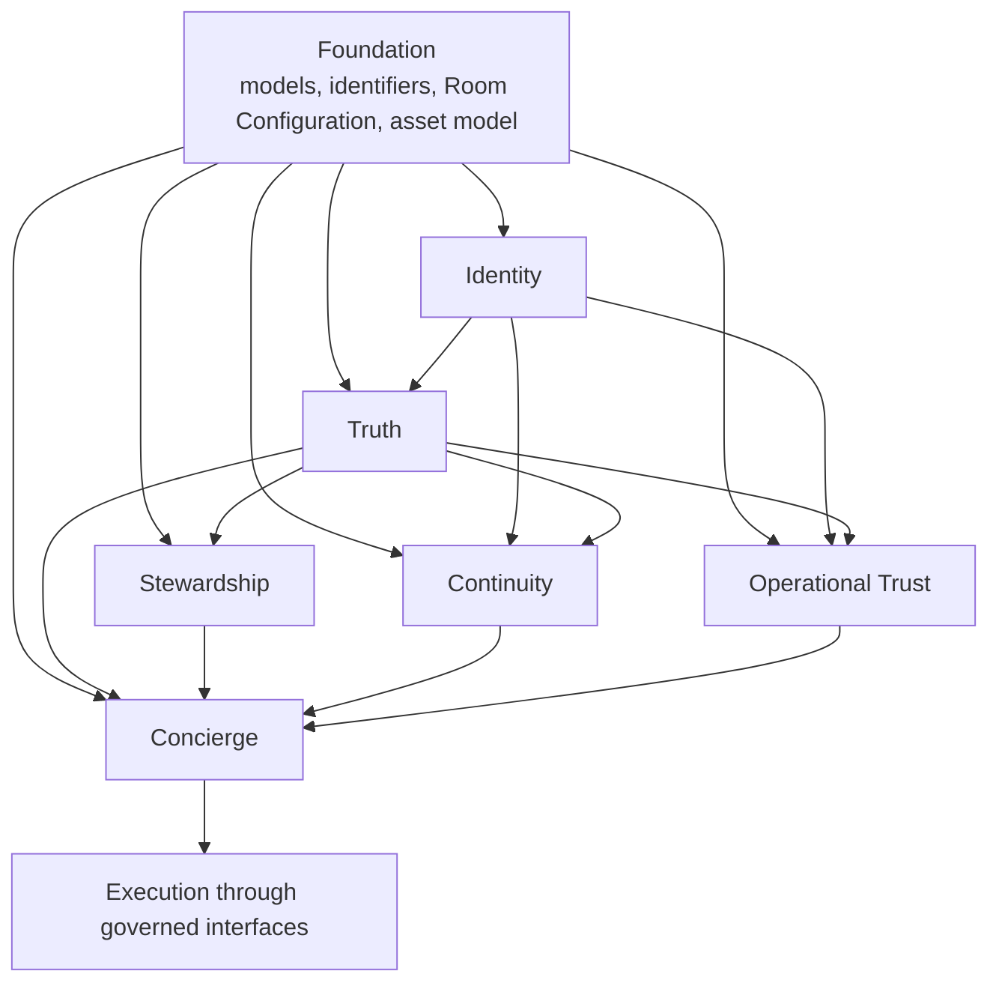

# Dependency View

> **Document status: Canonical.**
> This is one of three separate views of the framework. See [north-star.md](north-star.md) for
> framework order and [runtime-sequence.md](runtime-sequence.md) for request sequence.

---

## Purpose

The North-Star framework order describes how HTBW is taught and assessed. It does **not** describe
which responsibility consumes which. This document does.

**Do not reorder the North-Star framework to match this view.**

---

## Dependency flow



---

## Who consumes what

| Responsibility | Consumes | Never consumes as authority |
|---|---|---|
| Foundation | Nothing. Foundation is definitional. | — |
| Identity | Foundation models; identity evidence sources; enrollment records | Truth facts about occupancy; preferences; policies |
| Truth | Foundation models; Room Configuration composite-fact inputs; device and sensor evidence; Identity assertions; governed external sources | Preferences; obligations; policies; Concierge decisions |
| Stewardship | Foundation models and asset model; Truth facts; schedules and service records; the caretaker-of relationship type | Identity evidence; Concierge decisions |
| Continuity | Foundation models; Identity assertions; Truth facts; explicit human instruction | Policies as authority; obligations |
| Operational Trust | Foundation models; Identity assertions and confidence; Truth facts; Role assignments; consent records | Preferences as permission; obligations as permission |
| Concierge | Everything above, as governed inputs | Nothing as an ownership transfer |

---

## Directional rules

1. **Dependencies flow toward Concierge.** No responsibility consumes a Concierge decision as an
   input to its own authority.
2. **Identity feeds Truth; Truth does not feed Identity authority.** Truth may use an identity
   assertion as evidence for a contextual person-presence fact. Identity does not redefine its
   confidence based on a Truth fact.
3. **Truth feeds Operational Trust; Operational Trust does not feed Truth.** A policy never changes
   what is true.
4. **Stewardship feeds Concierge; Stewardship does not act.** An unmet obligation is a condition,
   never an instruction.
5. **Continuity feeds Concierge; Continuity does not choose.** Continuity provides preferences,
   active state, and transfer or resume intent.
6. **Foundation feeds everything and consumes nothing.** If Foundation needs a fact to define a
   model, the model is wrong.

---

## Cycle prohibition

The dependency graph must remain acyclic. If a proposed design requires a cycle — for example a
policy that depends on a decision that depends on that policy — the design has misplaced a
responsibility. Record the problem as an open decision in
[../governance/decision-ledger.md](../governance/decision-ledger.md) rather than introducing the
cycle.

### The bounded Identity ⇄ Truth interaction is not a cycle

Rule 2 is frequently misread as circular, because Truth appears on both sides of an identity
conclusion. It is not, and the distinction is structural rather than stylistic.

```text
evidence  →  IDENTITY  →  Identity Assertion  →  TRUTH  →  Contextual Person-Presence Fact
                                                                  (Person subject)

             TRUTH  →  Room occupancy Fact  ──┐        (Room subject)
                                              └── may re-enter a LATER Identity fusion
                                                  as ONE evidence family only
```

**Truth establishes *occupancy* — a Room-subject Fact — before fusion. Truth establishes *person
presence* — a Person-subject Fact — only after it.** These are two different Fact Subjects at two
different points in the sequence, and reading them as one object is what produces the illusion of a
loop.

Four properties keep the path open:

| # | Property | Effect |
|---|---|---|
| 1 | **Subject separation** | Only the Room-subject occupancy Fact re-enters fusion. A Person-subject presence Fact never does, so no fusion consumes its own output |
| 2 | **Family ceiling (F1, DL-38)** | Room occupancy may support *that the Room is occupied* and never *which Person, who spoke, or who initiated* |
| 3 | **Candidate-set exclusion (DL-38)** | Occupancy is not an admissible source of a candidate Person. **Occupancy is not identity** |
| 4 | **Exact-version referencing (P30, DL-27)** | Every stage references the exact prior version it used, so no evaluation can consume a result it has not yet produced |

Four statements follow, and each is binding:

- **Identity produces Identity Assertions.** Identity alone performs fusion.
- **Truth consumes Identity Assertions**, as one input among the Room's configured occupancy evidence.
- **Truth does not determine identity, and Truth does not re-run identity fusion.**
- **Truth produces Contextual Person-Presence Facts.**

> **A teaching narrative in which Truth first establishes person presence and Identity then consumes it
> to decide who is engaging inverts DL-06 and P9 and must not be used.**

See [../models/truth.md](../models/truth.md) and
[../models/person-and-identity.md](../models/person-and-identity.md).

> **One directional question in this domain remains genuinely open.** Resolving **Room Context** for an
> interaction arriving through a surface that is not bound to a Room would, on the obvious reading,
> require **Foundation to consume a Truth Fact**, contradicting rule 6. That is **open decision OD-73**,
> and it is recorded rather than resolved by introducing the dependency.

---

## Related documents

- [framework.md](framework.md)
- [runtime-sequence.md](runtime-sequence.md)
- [../contracts/README.md](../contracts/README.md)
