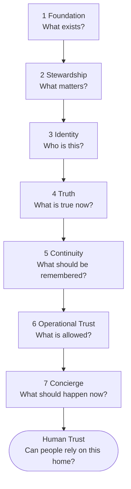

# The Homes That Behave Well North-Star Framework

> **Document status: Canonical (constitutional).**
> This document is the highest architecture authority in this repository, subordinate only to the
> North-Star framework as represented in the HTBW video-series artifacts.
> Terminology is defined in [docs/models/glossary.md](../models/glossary.md).

---

## Purpose

Homes That Behave Well (HTBW) is not a collection of Home Assistant integrations.

HTBW is:

- a home architecture framework
- an assessment methodology
- a canonical household model
- a set of responsibility contracts
- a behavioral governance model
- a reference platform
- a future Home Assistant implementation

The framework is the constitution. The platform is an implementation of the framework.

The framework is not retrospective documentation for the platform.

---

## The Question Each Responsibility Answers

The North-Star framework is composed of seven responsibilities.

| # | Responsibility | Question answered |
|---|---|---|
| 1 | [Foundation](../contracts/foundation-contract.md) | What exists, and how do we describe it? |
| 2 | [Stewardship](../contracts/stewardship-contract.md) | What matters, and what must be cared for? |
| 3 | [Identity](../contracts/identity-contract.md) | Who do we believe this is? |
| 4 | [Truth](../contracts/truth-contract.md) | What is actually true now? |
| 5 | [Continuity](../contracts/continuity-contract.md) | What should be remembered, resumed, or transferred? |
| 6 | [Operational Trust](../contracts/operational-trust-contract.md) | What is allowed? |
| 7 | [Concierge](../contracts/concierge-contract.md) | What should happen now? |

**Human Trust** is not a layer. Human Trust is the outcome produced when all seven behave well
together. See [Human Trust and Explainability](explainability.md).

---

## North-Star Framework Order

This is the framework order used in HTBW North-Star artifacts, presentations, the assessment
workbook, and the video series.

**The framework order is not the dependency order and is not the runtime sequence.**

Three separate views exist and must not be conflated:

| View | Document | What it shows |
|---|---|---|
| Framework order | this document | How the framework is taught, assessed, and presented |
| Dependency flow | [dependency-view.md](dependency-view.md) | Which responsibility consumes which |
| Runtime sequence | [runtime-sequence.md](runtime-sequence.md) | The order in which a single request is evaluated |

Do not reorder the North-Star framework to match runtime dependency order.

---

## Cross-Cutting Architecture

Some concepts are architecture, but are **not** framework layers. Making every concept a layer
would destroy the responsibility model.

| Cross-cutting area | Document | Why it is not a layer |
|---|---|---|
| Behavioral Governance | [behavioral-governance.md](behavioral-governance.md) | It is the policy and rule surface applied *by* Operational Trust and *resolved by* Concierge |
| Explainability and Decision Trace | [explainability.md](explainability.md) | Every responsibility must contribute to it; none owns it exclusively |
| Historical Explainability | [explainability.md](explainability.md) | It is Explainability across time. It **assembles** governed historical records and owns no historical store |
| Temporal record and change history | [../models/temporal-record.md](../models/temporal-record.md) | Foundation defines the shared model; each responsibility records, snapshots, and holds its own history. There is no central history owner |
| Communication and delivery | [../models/communication.md](../models/communication.md) | Foundation defines the model; any responsibility may originate a Communication; Operational Trust governs entitlement; Concierge decides and records delivery. There is no central delivery owner |
| Privacy and data minimization | [privacy.md](privacy.md) | It constrains all responsibilities |
| Failure, uncertainty, degradation | [failure-and-degradation.md](failure-and-degradation.md) | It is a required behavior of every responsibility |
| Room Configuration | [../models/room-configuration.md](../models/room-configuration.md) | It is a Foundation-owned interaction-definition model, not a separate responsibility |
| Contextual Vocabulary | [../models/contextual-vocabulary.md](../models/contextual-vocabulary.md) | It is part of Room Configuration |
| Assessment traceability | [../assessment/assessment-to-platform.md](../assessment/assessment-to-platform.md) | It is a methodology view over the framework |
| Home Assistant boundary | [home-assistant-boundary.md](home-assistant-boundary.md) | It is a platform-mapping concern, not a household responsibility |

**Historical Truth is not a cross-cutting area and not a layer.** It is **Truth extended across
time**, owned by the responsibility that already owns Facts. See
[adr-historical-explainability-and-historical-truth.md](adr-historical-explainability-and-historical-truth.md).

**The Household Inbox is not a cross-cutting area, not a layer, and not a store.** It is a
**projection** over outstanding Communications, filtered by the viewer's authority at read time. See
[../models/communication.md](../models/communication.md).

---

## The Standalone Products Are Not Framework Layers

HTBW previously described itself as a "four-service platform" whose services were Foundation,
Asset Intelligence, Voice Identity, and Concierge. That model is **superseded**.

| Previous platform service | Current disposition |
|---|---|
| Foundation | Retained and expanded as a framework responsibility. Foundation no longer owns Truth. |
| Asset Intelligence | Remains a **separate released product with its own lifecycle**, and **is not retired**. It is not an HTBW Core framework layer, and **HTBW must never require it to be installed** (**DL-51**). The HTBW **asset model** is a Foundation-owned descriptive model; **significance and care** belong to Stewardship. See [../models/asset.md](../models/asset.md). |
| Voice Identity | **Superseded as a product boundary inside HTBW Core.** The responsibility is now **Identity**. Voice is one identity-evidence source among many. **The standalone integration will sunset** (**DL-51**). See [../models/person-and-identity.md](../models/person-and-identity.md). |
| Concierge | Retained as the orchestration and resident-interaction responsibility. Concierge no longer owns records it consumes. **The standalone integration will sunset** (**DL-51**); the responsibility is unchanged by that. |

The standalone Asset Intelligence repository is untouched by this refoundation, keeps its own
release lifecycle, and creates no compatibility requirement for HTBW Core. See
[greenfield-mandate.md](greenfield-mandate.md).

> **Product disposition and responsibility disposition are separable, and DL-51 depends on that
> separation.** A responsibility may be first-class inside HTBW while its released product continues,
> and a product may sunset while its responsibility is unchanged. A household's existing Asset
> Intelligence data may be **adopted once** into HTBW under **DL-52** — **one-time, authoritative, and
> terminating**, never a runtime dependency and never synchronisation. See
> [adr-product-disposition-and-legacy-adoption.md](adr-product-disposition-and-legacy-adoption.md).

---

## The Canonical Statement

> **Concierge orchestrates. It does not own everything it consumes.**

---

## Scope of the Framework

The framework must support the full lifecycle, not merely an inventory:

1. Inventory
2. Framework classification
3. Capability assessment
4. Responsibility assessment
5. Gap identification
6. Architecture design
7. Implementation planning
8. Operational validation
9. Continuous improvement

The assessment output must be capable of becoming structured input to the HTBW platform. See
[../assessment/assessment-to-platform.md](../assessment/assessment-to-platform.md).

The framework is vendor-agnostic. Home Assistant is the initial reference implementation, not the
definition of the framework.

---

## Related documents

- [framework.md](framework.md) — responsibilities in full
- [principles.md](principles.md) — canonical principles
- [greenfield-mandate.md](greenfield-mandate.md) — compatibility position
- [../models/temporal-record.md](../models/temporal-record.md) — the shared temporal model
- [../governance/authority-order.md](../governance/authority-order.md) — how conflicts are resolved
- [../governance/decision-ledger.md](../governance/decision-ledger.md) — accepted and open decisions
- [../models/glossary.md](../models/glossary.md) — canonical terminology
