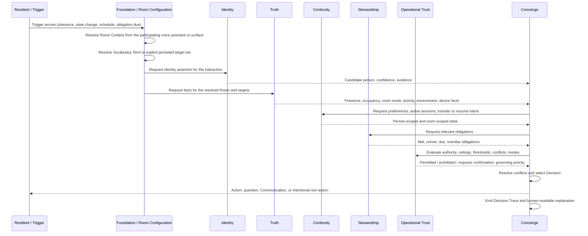

# Runtime Sequence View

> **Document status: Canonical.**
> This is one of three separate views. See [north-star.md](north-star.md) for framework order and
> [dependency-view.md](dependency-view.md) for consumption dependencies.

---

## Purpose

This document describes the order in which a **single request or trigger** is evaluated. It is not
the framework order and not the dependency graph.

---

## Canonical evaluation sequence

---

## Steps in words

| # | Step | Owner |
|---|---|---|
| 1 | Trigger arrives | — |
| 2 | Room Context resolution | Foundation / Room Configuration |
| 3 | Vocabulary resolution to an explicit target set | Foundation / Room Configuration |
| 4 | Identity assertion for the interaction | Identity |
| 5 | Authoritative facts for the Room, people, and targets | Truth |
| 6 | Preferences, active sessions, transfer or resume intent | Continuity |
| 7 | Relevant obligations and their state | Stewardship |
| 8 | Authority, thresholds, ceilings, modes, priority, confirmation requirement | Operational Trust |
| 9 | Conflict resolution and decision selection | Concierge |
| 10 | Action, question, Communication, or intentional non-action | Concierge |
| 11 | Decision Trace and explanation | Concierge |

Where the outcome is a **Communication**, the same ordering governs its delivery: Operational Trust
determines entitlement and audience eligibility, Identity supplies candidate persons, Truth supplies
who can perceive the surface, Continuity supplies the re-presentation preference, and Concierge
resolves the audience to surfaces, decides, and records. See
[../models/communication.md](../models/communication.md).

---

## Sequence rules

- **Context before intent.** Room Context and Vocabulary resolution happen before intent handling.
  A request is never interpreted against an unresolved Room.
- **Resolution before discovery.** If an explicit vocabulary mapping exists, it is used. Runtime
  device discovery is not a substitute for configuration.
- **Identity before authorization.** Operational Trust cannot evaluate authority without an identity
  assertion or an explicit unresolved-identity path.
- **Truth before decision.** Concierge does not act on evidence; it acts on facts.
- **Trace always.** Steps 10 and 11 are inseparable. A decision without a trace is not a completed
  decision. See [explainability.md](explainability.md).

### Why Identity appears before Truth, and why that is not a cycle

Step 4 precedes step 5, while [../models/truth.md](../models/truth.md) makes the Identity Assertion an
**input** to the person-presence Fact. Both are correct, and the apparent contradiction is a reading
error worth closing here.

| Step | What Truth is doing | Fact Subject |
|---|---|---|
| Before step 4 | Establishing **occupancy, room-state, environmental, and device** Facts from configured evidence | **Room**, Device, Home |
| Step 4 | Not acting. **Identity** fuses evidence into a purpose-specific assertion | — |
| Step 5 | Establishing the **Contextual Person-Presence Fact** from that assertion | **Person** |

> **Occupancy precedes fusion. Person presence follows it.** They are different Fact Subjects, so no
> responsibility consumes its own output and the graph stays acyclic.

**Identity produces Identity Assertions; Truth consumes them; Truth does not determine identity and does
not re-run identity fusion.** The four cycle-prevention properties are recorded in
[dependency-view.md](dependency-view.md).

### Room Context resolution at step 2

Step 2 resolves Room Context from the **participating voice assistant or surface**. Where the surface is
**not bound to a Room** — a phone, a wearable, a Companion App action, a browser session — **no governed
resolution rule exists**, the outcome is `unresolved`, and the degraded path below applies. **Room Context
is never inferred from device naming.** This is **open decision OD-73**, and the Decision Trace must
record Room Context **and how it was resolved**.

---

## Degraded sequences

Any step may fail or return uncertainty. The sequence does not abort silently; it degrades according
to [failure-and-degradation.md](failure-and-degradation.md).

| Failing step | Typical governed fallback |
|---|---|
| Room Context unresolved | Ask which Room, or refuse, per policy |
| Vocabulary unmapped or ambiguous | Ask which target, or refuse; never guess by entity name |
| Identity unresolved | Apply the unidentified-person policy; guest-safe behavior |
| Truth cannot establish a fact | Preserve uncertainty; prefer benign action, ask, or take no action |
| Continuity state lost | Do not fabricate a session; offer resume where eligible |
| Operational Trust cannot decide | Refuse or require confirmation; never assume permission |
| Concierge cannot resolve a conflict | Preserve the current experience and record an unresolved state |

---

## Related documents

- [dependency-view.md](dependency-view.md)
- [behavioral-governance.md](behavioral-governance.md)
- [explainability.md](explainability.md)
- [../models/decision-trace.md](../models/decision-trace.md)
- [../scenarios/README.md](../scenarios/README.md)
