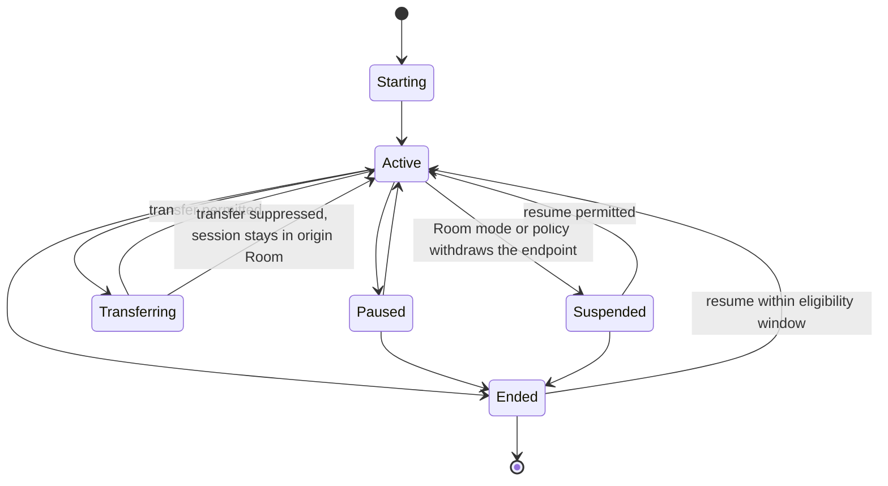

# Experience and Session Model

> **Document status: Canonical model.**
> Terminology: [glossary.md](glossary.md). Owning responsibility: **Continuity**.
> Contract: [../contracts/continuity-contract.md](../contracts/continuity-contract.md)
> Foundation defines the object types. Concierge consumes this model to coordinate; coordination is a
> consumer relationship, not co-ownership.

---

## Purpose

Separate the *kind of thing happening* (Experience) from the *specific instance running* (Session),
so that transfer, resume, suppression, conflict, and explanation have precise subjects.

## Question answered

*What is running, who owns it, where is it, and what may happen to it?*

---

## Experience

An Experience is a coherent household-facing activity that can be started, transferred, resumed,
suppressed, or ended.

Representative classes:

| Class | Examples |
|---|---|
| Media | Music, video, podcast, radio |
| Informational | Briefing, status summary, knowledge answer |
| Environmental | Comfort scene, lighting scene, shade scene |
| Routine | Good Night, Good Morning, Away, Arrival |
| Conversational | An active conversation with the home |
| Care | A medication reminder flow, a maintenance walkthrough |

An Experience defines what endpoints it needs (for example, a music endpoint) and what Room
Configuration must supply for it to be available in a Room.

---

## Session

A Session is a specific running instance of an Experience.

| Element | Purpose |
|---|---|
| Session identity | Distinguishes this instance |
| Experience class | What kind of thing this is |
| Owner | The Person whose session it is, where applicable |
| Participants | Other people currently engaged |
| Origin Room | Where it started |
| Current Room | Where it is now |
| Started at | Lifecycle timestamp |
| State | Starting, active, paused, transferring, suspended, ended |
| Transfer intent | Follow-Me, ask-before-transfer, never-transfer |
| Resume eligibility | Whether and until when it may be resumed |
| Blocking state | Why a transfer or resume is currently not eligible, with attribution |

A Room may host at most one *primary* experience per endpoint class at a time; additional sessions
constitute a conflict to be resolved. Whether a Room permits concurrent sessions of the same class is
household policy.

---

## Lifecycle

**A suppressed transfer is not a failure state.** The session remains active in its origin Room, and
the suppression is recorded with a reason.

---

## Ownership and participation

- A Session has an owner where it was started by or on behalf of a person.
- A Room experience may have no personal owner (for example, a shared scene).
- Participants may join without becoming owners.
- Ending or modifying another person's session requires authority granted by Operational Trust.

---

## Conflict subjects

Precise conflict statements require both concepts:

| Statement | Subject |
|---|---|
| "Music is already playing in the Kitchen" | An active **Session** in that Room |
| "Tom's Jazz session wants to follow him" | A **Session** with transfer intent |
| "Nighttime mode prohibits incoming media" | A Room **mode** versus an **Experience** class |
| "David's arrival must not replace Tom's session" | Two **Sessions**, one Room |

---

## Consumes

- Foundation Experience and Room definitions
- Room Configuration experience endpoints
- Identity assertions for ownership attribution
- Truth facts for Room state and availability

## Provides

- Session state to Concierge for conflict resolution
- Transfer and resume eligibility with blocking attribution
- Experience history and resume candidates

## Explicit non-responsibilities

This model does **not** decide whether a session may move, may be displaced, or may start. Those are
Operational Trust policy questions resolved by Concierge.

---

## Failure behavior

| Condition | Behavior |
|---|---|
| Endpoint disappears mid-session | Session becomes Suspended with a reason; do not silently end it |
| Owner identity becomes unresolved | Session retains its recorded owner; do not reassign it |
| Platform restart | Do not fabricate an Active session; re-establish only what is verifiable |
| Two sessions claim one endpoint | Report a conflict; do not resolve inside this model |

## Privacy considerations

Session content and history reveal personal habits. Visibility follows Operational Trust policy;
guests do not see residents' session history.

## Explainability requirements

Every session state transition that resulted from a decision — especially a suppression or a refusal
to displace — carries the Decision Trace reference that caused it.

---

## Representative scenarios

- [../scenarios/follow-me-media.md](../scenarios/follow-me-media.md)
- [../scenarios/multi-person-conflict.md](../scenarios/multi-person-conflict.md)

## Open decisions

| ID | Question |
|---|---|
| OD-24 | Session-merging algorithm |
| OD-25 | Resume eligibility window defaults per experience class |
| OD-27 | Whether concurrent same-class sessions in one Room are permitted by default |

## Related documents

- [continuity.md](continuity.md)
- [decision-trace.md](decision-trace.md)
- [../architecture/behavioral-governance.md](../architecture/behavioral-governance.md)
